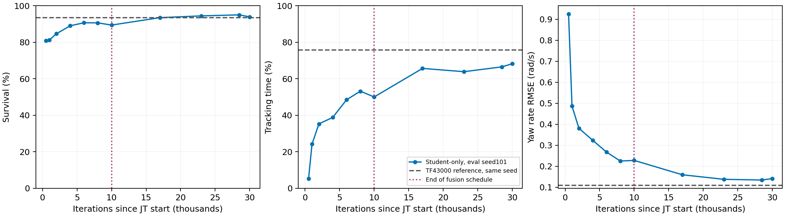
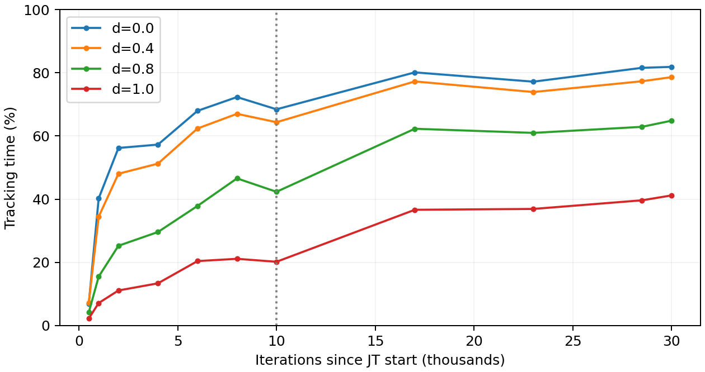
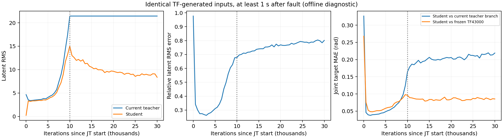

# JT 중간 체크포인트와 학생 적응 분석 — 2026-09-28

**핵심 판단:** 초기 혼합 정책의 높은 성능은 학생 단독 모방 완료를 뜻하지 않는다. 전환 후반에는 모방 대상인 Teacher latent 자체가 크게 변했다. 전환 시간 연장만을 해법으로 단정하기보다 Teacher encoder 고정과 전환 길이 연장을 별도로 비교한다.

## 질문과 범위

- 초기 500 iteration의 높은 학습 reward가 학생 단독 성능을 뜻하는지 확인한다.
- 모방 시간 부족과 전환 후 표현 변화, 정책 성능을 구분한다.
- 회복률 및 기존 1초 구간 획득률은 분석에서 제외한다.
- 학습 코드/체크포인트는 변경하지 않고 평가와 분석만 수행한다.

## 방법

### 폐루프 학생 단독 평가

- 수정된 onset v2 평가기를 사용했다. 모든 JT 체크포인트를 student-only 경로로 실행한다.
- vx=0.5 m/s, vy=0, yaw rate=0. onset 2–10초 무작위, 이후 20초.
- 12관절 × d={0,.2,.4,.6,.8,1} × 48반복 = checkpoint/seed당 3,456회.
- 아래 전체 평균은 d=.2,.4,.6,.8,1의 고장 조건을 동일 비중으로 집계한다. d=0은 별도 대조군이다.
- 신규 시뮬레이션은 19회 × 3,456 = 65,664 episode다. 저장된 61개 JT checkpoint는 두 공통 입력 집합에서 추가 분석했다.
- Q: 살아 있으면서 |ex|≤.1 m/s, |ey|≤.1 m/s, |eω|≤.2 rad/s를 동시에 만족한 시간/20초. 종료 후 시간도 분모에 남는다.
- 먼저 seed101로 10개 중간/후반 체크포인트를 조사하고, 선택한 단계는 seed102/103에서 추가 확인한다. 이 선택적 진단은 최종 독립 성능 비교가 아니다.
- 기존 TF43000/JT71500 결과는 동일 프로토콜의 저장 자료를 재사용했다. 모든 신규 학생 실행의 초기 물리 상태/관측/지형/고장 배정 해시가 기존 seed별 자료와 같은지 검사한다.
- 평가 seed 여러 개는 학습 seed 여러 개가 아니다. 모든 결과는 한 JT 학습 궤적의 체크포인트들이다.

### 동일 입력의 encoder/actor 분석

- TF43000과 JT71500의 시뮬레이션에서 current235, history50×48, privileged45를 기록하여 두 공통 입력 집합을 구성한다.
- 모든 저장 체크포인트의 학생/티처 encoder를 같은 입력에 적용하고 latent 상대 오차, 출력 RMS, cosine, 같은 actor의 행동 차이를 비교한다.
- 동일 체크포인트의 teacher branch는 학습 중 변한 shared actor와 결합된다. TF43000과 같은 기준 정책이 아니며, alpha=1 이후에는 teacher branch가 정상 작동한다고 가정하지 않는다.
- 따라서 현재 teacher branch와의 차이 외에 고정 TF43000 행동과의 차이도 계산한다.
- 두 정책이 각각 방문한 상태에서 확인하지만, 공통 입력 오차는 인과효과나 모든 상태에서의 성능을 증명하지 않는다.

## seed101 학생 단독 결과

| 체크포인트 | JT 경과 iter | 학습 중 학생 비중 | 생존율 | Q | d=1 Q | yaw RMSE (rad/s) |
|---|---:|---:|---:|---:|---:|---:|
| 43500 | 500 | 5% | 80.90% | 5.31% | 2.27% | 0.925 |
| 44000 | 1,000 | 10% | 81.25% | 24.18% | 7.15% | 0.486 |
| 45000 | 2,000 | 20% | 84.58% | 35.30% | 11.12% | 0.380 |
| 47000 | 4,000 | 40% | 88.99% | 38.81% | 13.39% | 0.323 |
| 49000 | 6,000 | 60% | 90.62% | 48.48% | 20.42% | 0.267 |
| 51000 | 8,000 | 80% | 90.59% | 53.18% | 21.14% | 0.225 |
| 53000 | 10,000 | 100% | 89.38% | 50.02% | 20.20% | 0.228 |
| 60000 | 17,000 | 100% | 93.44% | 65.66% | 36.65% | 0.159 |
| 66000 | 23,000 | 100% | 94.41% | 63.85% | 36.92% | 0.138 |
| 71500 | 28,500 | 100% | 94.97% | 66.50% | 39.64% | 0.134 |
| 73000 | 30,000 | 100% | 93.85% | 68.22% | 41.20% | 0.141 |

학생 단독 평가는 표의 학습 비중과 무관하게 항상 학생 latent만 사용했다.

## 추가 seed 확인

| 체크포인트 | 평가 seeds | 전체 Q 평균 | 전체 생존율 | d=1 Q |
|---|---|---:|---:|---:|
| 51000 | 101, 102, 103 | 52.95% | 90.35% | 21.52% |
| 53000 | 101, 102, 103 | 49.49% | 88.38% | 20.12% |
| 71500 | 101, 102, 103 | 66.10% | 94.47% | 39.44% |
| 73000 | 101, 102, 103 | 68.18% | 93.80% | 41.63% |

51,000→53,000의 Q 하락은 세 평가 seed에서 모두 나타났다(평균 −3.46%p). 73,000은 71,500보다 Q가 2.08%p 높지만 생존율은 0.67%p 낮다. 따라서 73,000을 무조건 더 좋은 모델로 교체하지 않는다. 이 차이는 한 학습 run 내의 진단이며 독립 학습 반복의 통계적 증거는 아니다.

## 초기 500 iteration 혼합 경로 대 학생 단독 경로

같은 model43500, 같은 초기 물리 상태/지형/고장 배정에서 혼합 alpha=.05와 학생 단독 경로를 비교했다. 고장 조건 2,880회, 평가 seed101.

| 실행 경로 | 생존율 | 추종 시간 Q |
|---|---:|---:|
| 혼합 (Teacher95%, Student5%) | 91.91% | 67.33% |
| Student-only | 80.90% | 5.31% |

이 실험은 초기 높은 학습 그래프가 학생 단독 성능을 뜻하지 않는다는 직접적인 증거다. 학생 모방 손실은 초기에 줄었지만 학생이 티처 도움 없이 같은 성능을 내지는 못했다.

## 같은 입력에서의 latent 및 행동

공통 TF 상태 입력 14589개, 공통 JT71500 상태 입력 14711개에 저장된 61개 JT checkpoint를 각각 적용했다. 아래는 고장 1초 이후, d>0 입력만 사용한 결과다.

### TF43000가 방문한 동일 상태

| checkpoint | Teacher latent RMS | Student latent RMS | 상대 latent RMS 오차 | 같은 actor의 목표 관절각 MAE (rad) |
|---|---:|---:|---:|---:|
| 43500 | 3.514 | 3.291 | 0.342 | 0.046 |
| 45000 | 3.491 | 3.318 | 0.274 | 0.040 |
| 49000 | 4.569 | 4.188 | 0.344 | 0.054 |
| 51000 | 8.918 | 7.222 | 0.560 | 0.074 |
| 53000 | 21.445 | 15.020 | 0.678 | 0.164 |
| 60000 | 21.445 | 9.972 | 0.754 | 0.200 |
| 71500 | 21.445 | 8.807 | 0.804 | 0.219 |
| 73000 | 21.445 | 8.360 | 0.801 | 0.219 |

상대 오차는 `RMS(zS−zT)/RMS(zT)`다. 무차원이며 직접적인 성공률이 아니다. 목표 관절각 MAE는 같은 current observation에서 동일 actor에 zS/zT를 넣어 나온 action 차이의 절댓값 평균 × 0.25 rad이다.

### 학생이 방문한 상태에서도 확인

| checkpoint | Teacher latent RMS | Student latent RMS | 상대 latent RMS 오차 |
|---|---:|---:|---:|
| 45000 | 3.408 | 3.265 | 0.360 |
| 53000 | 22.181 | 13.215 | 0.730 |
| 71500 | 22.181 | 7.927 | 0.862 |

- 같은 입력에서도 Teacher 출력 크기가 커지므로, 학습 로그의 증가가 방문 상태분포 변화만으로 생긴 것은 아니다.
- `Latent/mean_abs`와 `Latent/mean_std`는 Teacher 출력 통계다. Student 출력 크기로 해석하면 잘못이다.
- alpha=1 이후 Teacher encoder 파라미터는 사실상 고정되지만 shared actor와 Student encoder는 계속 바뀐다. 동일 JT checkpoint의 Teacher branch를 원래 TF43000의 성능 기준으로 쓰면 안 된다.
- latent 차이가 커지는 동안 student-only Q는 장기적으로 좋아졌다. raw latent loss 하나로 학습 성공/실패를 판단할 수 없다.
- 공통 입력 분석은 동일 상태에서의 함수 차이를 확인한다. 폐루프 성능이나 원인의 통제 실험을 대체하지 않는다.

## 보고 배울 시간이 충분했는가

**확인된 사실:** +500은 학생 단독 운용에 부족했다. +10,000 전환 완료 시점도 이후 학생 단독 학습 결과보다 추종 성능이 낮았다. +17,000 이후는 1차 평가에서 Q 약64–68% 범위로 개선 폭이 줄었다.

**단정할 수 없는 부분:** 전환 시간이 부족해서 성능이 제한됐는지, 움직이는 Teacher 목표·actor와 encoder의 공동 변화·관측 정보·학습 목적 때문에 제한됐는지는 checkpoint 관찰만으로 분리되지 않는다. 10k/20k 전환의 통제 재학습이 필요하다. 현재 자료는 단순 시간 연장만으로 Teacher 수준이 된다는 근거가 아니다.

**가장 구체적인 추가 가설:** alpha가 커지고 beta가 작아지는 후반에 Teacher latent 크기가 증가했다. Teacher를 따라가는 정답 표현 자체가 움직인다. Teacher encoder를 고정하는 실험은 이 변수를 직접 분리한다. Teacher의 출력 확대가 전환 성능 저하의 원인이라는 인과 결론은 아직 내리지 않는다.

## 추가 구현 및 지표 점검

- CNN의 첫 conv(kernel8,stride4)는 오래된 순서의 50프레임 중 frame0..47을 사용한다. frame48/49는 gradient가 0임을 확인했다. 최신 40ms가 encoder latent에는 반영되지 않지만 current235 경로에는 최신 관측이 있으므로 전체 시스템이 40ms 지연된다는 뜻은 아니다.
- 선속도 추종 보상 항은 `exp(-(ex²+ey²)/0.25)`다. ey=0, ex=.11 m/s이면 Q의 .1 기준은 벗어나지만 해당 reward는 .953이다. Q가 낮은 원인을 encoder 모방 문제로만 단정할 수 없다.
- 실제 d×joint별 post-fault transition 수는 과거 aggregate 로그에서 복구할 수 없다. 향후 명시적으로 기록해야 데이터 부족 가설을 검증할 수 있다.
- 학습 episode 20초, onset2–10초라 고장 후 학습 구간은 최대10–18초다. 평가의 고장 후20초와 다르다. horizon 변경도 별도 실험 후보이지 이 분석에서 입증된 원인은 아니다.
- 기존 FrozenTeacherStudent 구현도 critic gradient가 Student에 유입될 수 있다. pure supervised encoder 실험으로 사용하려면 손실 경로를 별도로 정의해야 한다.

## 다음 실험

[재학습 계획 v1](../plan/jt_retraining_after_checkpoint_audit_v1.md)에 변경 범위와 통제 조건을 기록했다. 우선 Teacher encoder 고정 실험과 전환20k 실험을 분리한다. beta floor, 행동 모방, severe oversampling, history 정렬 변경을 한꺼번에 적용하지 않는다.

후속 행동 모방에서 학생이 유도한 상태를 포함하는 이유는 sequential imitation의 분포 이동 문제와 관련된다. 본 프로젝트에서 해당 원인이 입증됐다는 뜻은 아니다. 선행 근거: [DAgger](https://proceedings.mlr.press/v15/ross11a.html). 기존 T–S latent fusion의 출처: [Saving the Limping](https://arxiv.org/html/2210.00474v3).

## 산출물과 재현

- `logs/evaluations/jt-transition-audit-20260928/screen/`: 10개 checkpoint × seed101의 원시 결과/trace/로그/명령 manifest.
- `confirm/`: 51000/53000/73000 × seed102/103 확인 결과와 명령 manifest.
- `summary.json`, `training_windows.json`, `weights_audit.json`: 지표 집계, 학습 단계 로그 평균, 저장된 61개 가중치의 변화.
- `common_teacher_inputs.pt`, `common_student_inputs.pt`, `latent_corpus_audit.json`, `latent_student_corpus_audit.json`: 공통 입력과 encoder/actor 분석.
- `mixed_43500_seed101.jsonl`: 동일 모델/조건에서의 혼합 policy 시험.
- `history_receptive_field.json`: 최신2프레임 미사용의 자동미분 확인.
- 스크립트: `audit_jt_checkpoints.py`, `evaluate_jt_branch_diagnostic.py`, `analyze_jt_latent_corpus.py`, `summarize_jt_transition_audit.py`, `plot_jt_transition_audit.py` (모두 `legged_gym/scripts/`).
- 신규 production 학습, 모델 가중치 수정, 기존 평가 덮어쓰기는 수행하지 않았다. 모든 신규 simulation은 CUDA에서 실행했다.
