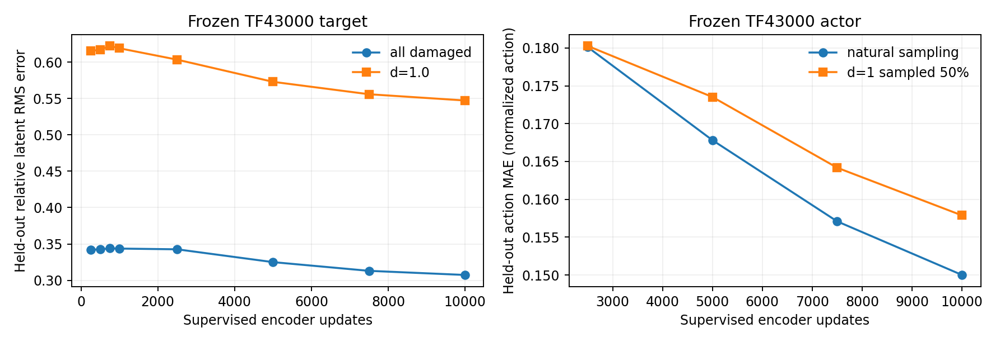

# 학생 인코더 모방 원인 실험 — 2026-09-28

> **2026-09-29 분할 정정:** 아래 초기 오프라인 실험 1·4·5의 검증 표는 수집기가 `joint = replicate % 12`로 한 관절씩 표본을 고른다는 사실을 반영하지 못한 `replicate % 4 == 3` 분할에서 계산됐다. 이 검증 집합에는 관절 인덱스 3·7·11만 있으며 12관절 전체 평균이 아니다. 관련 표는 **3관절 외삽 진단값**으로만 읽어야 한다. 모든 온라인 폐루프 평가는 12관절×6강도 전체를 별도로 시행했으므로 이 분할 오류와 무관하다. 후속 오프라인 실험은 12반복 블록 단위로 나누어 모든 관절을 검증에 포함한다.

## 연구 질문

1. 고정된 티처 표현을 학생 CNN이 충분히 학습할 수 있는가?
2. 저장된 상태에서의 모방 정확도가 실제 보행 성능으로 이어지는가?
3. 공동학습 중 움직이는 티처 표현을 고정하면 학생 단독 성능이 좋아지는가?

회복률은 이 실험의 평가 지표에서 제외한다. 학습 reward와 모방 손실은 진단용이며, 정책 선택은 학생 단독 추종 시간 비율 Q, 생존율, 속도 오차를 기준으로 한다.

## 실험 1 — 동일 데이터에서 인코더만 지도학습

TF43000과 JT71500 평가에서 저장한 입력을 합쳐 29,300개를 사용했다. 초기 분할은 학습 22,282개와 검증 7,018개였지만, 위 정정대로 검증 관절은 3개뿐이었다. 초기 학생 CNN, minibatch 선택, Adam 학습률 2.5e-4, batch512, 업데이트 1,000회는 모든 조건에서 동일하다. TF43000 액터는 고정했다. 수집 조건은 0.5 m/s 전진 명령과 mixed terrain으로 제한된다.

비교한 목표는 (a) 고정 TF43000 latent의 JT와 같은 L2 모방, (b) 같은 티처의 행동 직접 모방, (c) JT53000 latent를 처음부터 모방, (d) JT43000→45000→49000→53000 latent를 단계별로 모방하는 것이다. (c)/(d)는 동일한 최종 목표와 총 업데이트 수를 갖지만, (d)가 최종 목표를 보는 횟수는 적다. 학습 과정의 목표 이동을 보는 진단이며 실제 PPO 전환을 재현하지 않는다.

검증 입력 중 고장 후 1초 이상 지난 상태의 결과:

| 인코더 학습 목표 | 업데이트 | 최종 목표에 대한 상대 latent RMS 오차 | 동일 액터의 목표 관절각 MAE |
|---|---:|---:|---:|
| 고정 TF43000 latent | 0 | 0.999 | 0.243 rad |
| 고정 TF43000 latent | 250 | 0.342 | 0.047 rad |
| 고정 TF43000 latent | 1,000 | 0.344 | 0.046 rad |
| 고정 TF43000 행동 | 1,000 | 0.338 | 0.047 rad |
| JT53000 latent 고정 | 1,000 | 0.898 | 0.590 rad¹ |
| JT43000→53000 latent 이동 | 1,000 | 0.895 | 0.587 rad¹ |

¹ 이 두 줄의 행동 차이는 **TF43000 액터에 JT53000 latent를 입력한 오프라인 진단값**이다. JT53000 shared actor나 실제 보행 결과로 해석할 수 없다.

TF43000의 고정 표현은 학생이 초기에 빠르게 일부 모방했고, 250→1,000회 구간의 검증 개선은 작았다. 목표가 움직인 조건과 최종 목표가 고정된 조건은 1,000회 후 오차가 비슷하다. 이 오프라인 진단만으로 목표 이동이 실제 공동학습 성능의 병목이라고 결론낼 수 없다.

더 오래 학습하면 느리게 개선되는지도 같은 초기화와 설정으로 확인했다. 아래는 10,000 update run의 검증 결과다. 한정된 29,300 입력을 반복 사용한 지도학습이며 JT PPO iteration과 단위를 혼동하지 않는다.

| 지도학습 update | 학습 고장 상대 오차 | 검증 고장 상대 오차 | 검증 d=1 상대 오차 | 검증 고장 행동 MAE |
|---:|---:|---:|---:|---:|
| 2,500 | 0.297 | 0.343 | 0.603 | 0.180 |
| 5,000 | 0.260 | 0.325 | 0.573 | 0.168 |
| 7,500 | 0.237 | 0.313 | 0.556 | 0.157 |
| 10,000 | 0.218 | 0.307 | 0.547 | 0.150 |

더 많은 모방 업데이트는 여전히 도움이 됐다. 검증 오차가 0에 가까워지지는 않았고 학습·검증 차이도 남는다. 따라서 "시간이 부족했다"와 "학생에게 없는 정보를 티처가 사용한다"를 이 자료만으로 완전히 분리할 수 없다. 10,000회 학생의 폐루프 결과는 아래에 별도로 기록했다.

고장 후 1초 이상 지난 d=1.0 검증 입력에서 TF43000 latent를 모방한 학생의 상대 오차는 0.619, 행동 MAE는 0.350이다. 전체 고장 입력의 각각 0.344, 0.185보다 높다. 고장 직후에만 생기는 일시적 오차로 설명되지 않는다. 원인은 정보 식별성, 입력 범위, 학습 데이터, 모델 용량 중 추가 실험이 필요하다.

### 고장 발생 순간의 정보 차이

onset 이전에 저장된 **같은 observation/history**를 고정하고 privileged 입력의 한 관절 motor-strength와 failure flag만 고장 상태로 바꿔 TF43000에 넣었다. 티처는 d=1.0일 때 latent가 평균 L2 5.93, 행동이 평균 0.262 action 단위(목표 관절각 환산 0.0656 rad) 변했다. d=0.2에서는 각각 0.316, 0.022 action 단위였다. 같은 학생 입력에 대해 두 티처 목표가 달라지므로, 고장이 운동으로 드러나기 전 학생이 이 즉시 변화를 정확히 따라하는 것은 관측상 불가능하다. 이것은 **고장 직후 한 시점의 한계**이며, 이후 20초 성능 차이를 설명하는 근거는 아니다. TF와 JT71500 방문 상태에서 거의 같은 값으로 재확인했다.

### d=1 업데이트 비중을 늘린 별도 진단

두 수집 자료에서 강도별 고장 후 입력 수는 대체로 균등했다(각 강도 약 3,500개). 표본이 빠진 문제와 **업데이트 중 강한 고장에 할당하는 비중**을 구분하기 위해, 같은 총 1,000 update에서 d=1 post-fault 입력의 minibatch 비중만 변경했다. 다른 5개 강도와 onset 이전의 입력은 나머지 슬롯에서 선택했다.

| d=1 post-fault 학습 비중 | 검증 d=1 상대 latent 오차 | 검증 d=1 행동 MAE | 검증 전체 고장 행동 MAE |
|---:|---:|---:|---:|
| 자연 표본 비중(약 1/6) | 0.619 | 0.350 | 0.185 |
| 1/3 | 0.591 | 0.341 | 0.189 |
| 1/2 | 0.558 | 0.330 | 0.187 |

이 데이터에서는 d=1에 더 많은 업데이트를 주면 해당 조건의 모방 오차가 줄었다. 다른 조건에서 이익은 확인되지 않았고 전체 행동 오차는 오히려 약간 높았다. 학습 seed 하나·고정 입력의 결과이며, 공동학습에서의 생존/추종 개선으로 일반화하지 않는다. 실제 JT 재학습에서 고장 후 유효 transition 수를 먼저 기록해야 한다.

10,000 update에서도 같은 비중 비교를 했다. 자연 표본 대비 d=1을 1/2로 뽑으면 검증 d=1 상대 오차는 0.547→0.536으로 조금 줄었지만, d=1 행동 MAE는 0.297→0.299, 전체 고장 행동 MAE는 0.150→0.158로 악화됐다. 장시간 학습 시 심한 고장 표본 추가가 **실제 행동 모방을 개선한다는 증거는 얻지 못했다.**

### 최신 2프레임 입력 정렬

기존 CNN은 50프레임 중 0..47을 사용하고 48..49를 사용하지 않는다. 같은 인코더·학습 설정에서 입력을 2프레임 당겨 2..49를 사용하게 한 오프라인 진단을 수행했다. 고장 후 검증 상대 latent 오차는 기존 0.3437, 최신48프레임 사용 0.3439였다. 행동 MAE는 0.1853→0.1844로 거의 같았다. 이 입력 문제는 수정 대상이지만, **이번 고정 입력에서의 주된 모방 병목으로 보이지 않았다.** 폐루프 결과는 아직 이 입력 변형으로 확인하지 않았다.

## 실험 2 — 고정 TF43000 액터와 오프라인 학습 학생의 폐루프 보행

실험 1의 TF43000 latent 모방과 행동 모방 학생을 각각 **변경되지 않은 TF43000 액터**에 연결했다. 학습 입력을 수집한 seed101과 다른 평가 seed104/105를 사용했다. 각 seed는 12관절×6강도×48반복이며, 티처·학생 세 정책의 초기 물리 상태, 지형, 고장 배정 해시가 seed별로 정확히 일치한다. 평가 명령 0.5 m/s, 무작위 onset 2–10초, 고장 후 20초다.

| 정책 | 고장 조건 episode 수 | 생존율 | 추종 시간 비율 Q | d=1 생존율 |
|---|---:|---:|---:|---:|
| TF43000 티처 | 5,760 | 92.69% | 75.99% | 86.11% |
| 고정 티처 latent만 지도학습한 학생 | 5,760 | 19.01% | 0.10% | 6.94% |
| 고정 티처 행동만 지도학습한 학생 | 5,760 | 27.38% | 0.15% | 11.72% |
| 고정 티처 latent를 10,000회 지도학습한 학생 | 5,760 | 79.15% | 11.79% | 52.17% |

d=0에서도 1,000회 학생 둘의 생존율은 각각 27.08%, 37.85%였다. 따라서 이 초기 실패를 고장 식별 문제만으로 설명할 수 없다. 저장된 상태에서 약 0.046–0.047 rad의 목표 관절각 평균 차이가 있어도 폐루프에서는 오차가 누적된다. 10,000회 학생은 보행이 뚜렷이 개선됐지만 고장 조건 Q는 티처 75.99%에 비해 11.79%였다. 이 결과는 **이 수집 데이터와 고정 액터의 오프라인 모방만으로는 충분한 정책을 얻지 못했다는 근거**다. 학생이 실제 유도하는 상태에서의 학습과 공유 액터 적응을 별도로 검증해야 한다.

## 실험 3 — JT49000에서 티처 인코더 고정 개입

원본 JT49000 체크포인트에서 같은 가중치·옵티마이저·스케줄·환경 설정·seed31로 두 갈래를 이어 학습했다. 512개 환경 × 24 step/iteration이며 차이는 `teacher_encoder.requires_grad_(False)`뿐이다. 기존 JT49000을 재개한 **중간 단계 개입 실험**이다. 두 조건은 각각 추가 1,529/565 iteration에서 안전하게 중지했다. 성능 비교에는 두 조건에 공통인 **추가 500 iteration, model_49500.pt**만 사용한다. 두 실행을 다시 이어서 학습하지 않는다.

1 iteration 연기 시험과 실제 실행의 manifest에서 양쪽 초기 Teacher·Student·Actor 가중치 SHA, optimizer LR, seed, 환경 수가 같았다. baseline에서는 티처와 학생 가중치가 바뀌었고, 고정 조건에서는 티처만 그대로였다.

공통으로 저장된 두 평가 입력에서의 오프라인 진단(고장 1초 이후, TF가 방문한 상태 / JT71500이 방문한 상태 순서):

| 모델 | 티처 표현의 기준점 대비 변화 | 학생–현재 티처 상대 오차 | 같은 액터의 행동 MAE |
|---|---:|---:|---:|
| JT49000 시작점 | 0 / 0 | 0.344 / 0.399 | 0.214 / 0.244 |
| baseline49500 | 0.100 / 0.108 | 0.338 / 0.398 | 0.211 / 0.239 |
| teacher-freeze49500 | 0 / 0 | 0.335 / 0.404 | 0.205 / 0.235 |

고정 조건에서 티처 표현 변화가 사라진 것은 확인됐다. 학생 오차와 행동 차이는 두 조건 모두 시작점과 비슷하며, 이 표만으로 학생 단독 보행 향상을 판정할 수 없다. 시뮬레이션 평가 결과는 별도로 집계한다.

새 평가 seed104/105의 공통 초기 물리 상태·지형·고장 배정 해시를 조건별로 확인했다. 각 정책은 고장 조건 5,760 episode, d=0 1,152 episode를 사용했다. 동일한 .5 m/s 명령, onset2–10초, 고장 후20초다.

| 학생 단독 정책 | 고장 생존율 | 고장 추종 시간 Q | d=1 Q | d=0 Q |
|---|---:|---:|---:|---:|
| 시작 JT49000 | 88.75% | 48.21% | 19.98% | 67.66% |
| 티처 계속 학습, JT49500 | 89.36% | 45.95% | 20.66% | 62.92% |
| 티처 인코더 고정, JT49500 | 88.18% | 38.47% | 15.83% | 52.32% |

이 500-iteration 개입에서는 티처 고정이 baseline보다 Q를 **7.48%p 낮췄다**. d=0에서도 10.60%p 낮았다. 반면 공통 입력의 latent/행동 오차 차이는 작았다. **중간에 티처 인코더만 고정하는 방안은 현재 증거에서 채택하지 않는다.** 원인은 공유 액터/critic과 학생 표현의 공동 적응, 단일 학습 seed의 분기 민감도 등으로 분리되지 않았다. 이 실험은 TF43000에서 처음부터 고정하는 별도 방식의 성능을 예측하지 않으며, 500 iteration 이후의 효과도 말해주지 않는다.

[Saving the Limping의 공동학습 설명](https://arxiv.org/html/2210.00474v3)은 정확한 latent 복제가 어려워 액터가 학생 표현 차이에 적응하도록 함께 학습한다고 설명한다. 이 프로젝트의 오프라인 지도학습과 500-iteration 고정 개입은 그 메커니즘을 대체하거나 반증하지 않는다.

## 실험 4 — 고정 티처에 대한 모방 목적함수

동일 데이터·학생 초기화·총 10,000 update에서 손실만 바꿨다. 현재 JT 구현의 적응 손실은 평균 Euclidean norm `mean(||zS-zT||₂)`이다. [Saving the Limping의 본문](https://arxiv.org/html/2210.00474v3)은 제곱 노름을 수식으로 표기한다. 둘의 수학적 차이는 확인되지만, 논문의 수식이 반드시 최적 구현임을 뜻하지 않는다.

| 고정 TF43000 모방 손실 | 검증 고장 상대 latent 오차 | 검증 고장 행동 MAE | 검증 d=1 행동 MAE |
|---|---:|---:|---:|
| 현재 방식: latent 노름 | 0.307 | 0.150 | 0.297 |
| 논문 수식형: 제곱 latent 노름 | 0.310 | 0.153 | 0.296 |
| latent 차원별 정규화 제곱 | 0.315 | 0.155 | 0.299 |
| 티처 행동 MSE만 | 0.320 | 0.148 | 0.289 |
| latent 노름 + 행동 MSE×10 | **0.301** | **0.142** | **0.284** |

제곱 손실로 바꾸는 것만으로는 검증 행동 오차가 좋아지지 않았다. latent+행동 손실은 오프라인에서 가장 좋았으나, 행동항 10은 프로젝트의 실험값이며 논문의 수치가 아니다.

이 두 학생(기존 latent10k, latent+행동10k)을 고정 TF43000 액터에 연결해 seed106/107에서 평가했다. 각 정책은 고장 조건 5,760 episode이며 새 학습 시뮬레이션은 수행하지 않았다.

| 정책 | 고장 생존율 | 고장 추종 시간 Q | d=1 Q | d=0 Q |
|---|---:|---:|---:|---:|
| TF43000 티처 | 93.89% | 76.47% | 53.68% | 84.03% |
| latent만 10k update | 80.33% | 11.72% | 2.39% | 24.38% |
| latent+행동 10k update | 81.27% | **19.25%** | 4.99% | 35.02% |

학생의 Q 향상은 seed106(11.31→18.96%)과 seed107(12.13→19.53%)에서 같은 방향이었다. seed106은 평가 정책 간 초기 물리 상태·지형·고장 배정 해시가 일치했다. seed107은 지형·고장 배정·물성 해시는 같지만 Isaac Gym 초기 `root_states/dof_pos/dof_vel` 해시가 일치하지 않았다. 따라서 두 seed를 모두 **정확한 초기 상태의 paired 비교**라고 부르지 않는다. 이 결과는 고정 데이터 기반 정책의 진단이며, 최종 JT 개선 근거로 바로 쓰지 않는다.

## 실험 5 — 학생 방문 상태를 추가하는 모방 학습

TF43000 티처와 latent-only 10k 학생이 seed106에서 각각 방문한 상태를 수집했다. 기존 29,300개에 새 상태 14,023개씩을 추가하고, 동일한 latent-only 10k 학생에서 학습률 2.5e-4, batch512, 추가 10,000 update로 이어 학습했다. 티처 방문 상태와 학생 방문 상태의 표본 수·업데이트 수·초기 가중치는 동일하다. 이것은 온라인 PPO 재학습이 아니라, 고정 액터를 사용한 DAgger형 데이터 분포 진단이다.

| 추가 상태 | 기존 검증 입력의 고장 latent 상대 RMS | 기존 검증 입력의 고장 행동 MAE |
|---|---:|---:|
| 티처 방문 | 0.271 | 0.130 |
| 학생 방문 | 0.285 | 0.130 |

새로운 평가 seed108/109에서 정책마다 고장 5,760 episode를 사용했다. 두 seed 모두 각 정책의 초기 물리 상태, 물성, 지형, 고장 배정 해시가 일치한다.

| 고정 TF43000 액터에 연결한 정책 | 고장 생존율 | 고장 추종 시간 Q | d=1 Q | d=0 Q |
|---|---:|---:|---:|---:|
| TF43000 티처 | 93.33% | 76.61% | 53.76% | 85.72% |
| 기존 latent-only 10k 학생 | 78.96% | 12.26% | 2.54% | 25.89% |
| 티처 방문 상태 추가 학생 | 83.66% | 19.36% | 5.34% | 34.95% |
| **학생 방문 상태 추가 학생** | **88.85%** | **8.33%** | 7.16% | **8.34%** |

학생 방문 상태만 추가하면 생존은 증가하지만 정상 강도(d=0)까지 추종이 급격히 나빠진다. 강한 고장 d=1의 Q는 조금 올라가지만 전체 Q의 이득은 없다. 이 자료에서 학생 방문 상태를 무작정 섞는 방식은 채택하지 않는다. 무엇을 잘 모방했는지와 무엇을 잘 제어하는지는 다르며, 학생 분포로 모은 저품질 상태에 더 많은 가중치가 부여되면 안전하게 버티는 쪽으로 치우칠 수 있다. 마지막 해석은 원인 가설이며 독립적인 행동 분포 분석이 필요하다.

다음 온라인 실험은 같은 TF43000에서 **각각 처음 시작**해 기존 JT와 학생 행동 보조 손실 하나만 비교한다. 행동 보조 손실은 고정 티처 branch의 action mean을 목표로 하고, 공유 액터의 가중치는 이 손실로 업데이트하지 않는다. 실험값 10은 오프라인 목적함수 비교에서 선택한 후보이며 아직 JT에서 검증되지 않았다.

## 실험 6 — TF43000에서 새로 시작한 공동학습 행동 보조 손실

중단됐던 JT 학습을 재개하지 않고 TF43000에서 별도의 두 JT 실행을 시작했다. seed31, 512환경, 24 rollout step, 추가 2,000 iteration, 초기 티처·학생·액터 가중치 SHA와 optimizer 학습률이 일치한다. 한쪽에만 학생 행동 보조 손실 계수 10을 더했다. 티처 행동은 detach하고 공유 액터의 매개변수도 이 손실에서는 detach하므로, 보조 손실은 학생 인코더에만 기울기를 준다. 평가 seed110/111, 각 조건 고장 5,760 episode, 초기 물리 상태·지형·고장 배정 해시는 정책별로 일치한다.

| JT45000 학생 단독 | 생존율 | 추종 시간 Q | d=1 Q | d=0 Q |
|---|---:|---:|---:|---:|
| 기존 목적함수 | 78.56% | **24.17%** | **7.77%** | **38.80%** |
| 학생 행동 보조 손실×10 | **83.16%** | 16.86% | 4.88% | 25.45% |

두 seed에서 모두 추종이 하락했다(seed110 24.11→16.92%, seed111 24.23→16.79%). 공통 기록 입력에서도 보조 손실 조건의 학생-티처 latent 및 행동 차이가 오히려 약간 커졌다. 오프라인 고정 액터 모방에서의 개선은 **공유 액터·티처가 함께 변하는 초기 JT에서 재현되지 않았다.** 이 계수 10의 행동 보조 손실을 전체 재학습에 사용하지 않는다. 512환경·2,000 iteration의 조기 개입이므로 다른 계수나 후기 도입을 모두 기각하는 증거는 아니다.

다음 진단은 JT 전환 완료 후 `adaptation_beta=0`으로 학생 모방 항이 사라지는 영향을 분리한다. 완료된 원본 JT53000 체크포인트에서 기준/작은 beta floor를 똑같이 이어 학습하는 것은 **후기 기전 확인용 개입 실험**이며, 최종 개선 실행은 TF43000에서 새로 시작한다.

## 실험 7 — 전환 종료 후 latent 모방 신호 유지

완료된 원본 JT53000 체크포인트에서 같은 가중치·optimizer·학습률 1e-5·seed32·512환경으로 두 갈래를 추가 2,000 iteration 학습했다. 한쪽은 기존 β=0, 다른 쪽만 β 하한 0.01이다. 중단됐던 학습 체크포인트는 사용하지 않았다. seed114/115 평가의 각 조건은 고장 5,760 episode이며 초기 물리 상태·지형·고장 배정 해시가 정확히 일치한다.

| JT55000 학생 단독 | 고장 생존율 | 추종 시간 Q | d=1 Q | d=0 Q |
|---|---:|---:|---:|---:|
| 기존 β=0 | 82.97% | **43.99%** | **18.17%** | **58.36%** |
| β 하한 0.01 | 83.37% | 38.55% | 11.36% | 56.80% |

seed114에서 Q 42.85→36.98%, seed115에서 45.12→40.11%로 떨어졌다. 후기 latent 모방 항을 유지하면 학생이 티처 표현과 더 가까워질 수는 있어도 추종 향상은 확인되지 않았다. 원본 JT에서 α=1 이후에도 학생 정책 PPO가 계속 개선된 점과 일치한다. 이 β 하한 조건은 전체 재학습에서 제외한다. **이 결과는 완료된 JT53000에서의 2,000-iteration 개입**이며, TF43000에서 처음부터 다른 β 스케줄을 쓰는 경우까지 단정하지 않는다.

원본 JT71500과 JT73000도 학습에 사용하지 않은 seed116/117에서 같은 평가기로 다시 비교했다. 각 정책의 초기 물리 상태·지형·고장 배정 해시가 seed별로 일치한다.

| 원본 학생 체크포인트 | 고장 생존율 | 추종 시간 Q | d=1 Q | d=0 Q |
|---|---:|---:|---:|---:|
| JT71500 | 92.42% | 64.68% | 38.40% | 78.84% |
| JT73000 | **92.75%** | **67.06%** | **40.90%** | **80.38%** |

Q 차이는 seed116 +2.42%p, seed117 +2.34%p이다. 이 비교는 **훈련을 더 진행할 가치가 있음**을 뒷받침하지만, 73,000 이후에도 계속 오른다는 외삽이나 학습 seed 간 재현성을 보장하지 않는다. 최종 체크포인트는 별도 평가 seed에서 선택해야 한다.

## 실험 8 — 검증 분할 정정 및 고장 식별성

수집기는 각 반복 번호에서 `joint = replicate % 12` 하나를 표본으로 고른다. 초기 `replicate % 4 == 3` 검증은 관절 3·7·11만 포함했다. 분할을 `(replicate // 12) % 4 == 3`으로 고쳐 12관절 모두가 검증에 나타나도록 했다. 고장 강도도 0.2–1.0이 모두 들어간다. 아래 값은 새 분할에서 같은 seed11·29,300기록·batch512·학습률2.5e-4·10,000 update를 사용한 결과다. 기존 분할 결과와 수치 크기를 직접 비교하지 않는다.

| 오프라인 학생 CNN | 검증 고장 상대 latent RMS | 검증 고장 행동 MAE | 검증 d=1 행동 MAE |
|---|---:|---:|---:|
| 32채널, latent 손실 | 0.277 | 0.140 | 0.282 |
| 64채널, latent 손실 | **0.266** | **0.127** | **0.262** |
| 32채널, latent+고장 분류×0.25 | 0.275 | 0.145 | 0.292 |

고장 분류는 학생 8d에 관절 12종·고장 강도 5종의 선형 head를 임시로 붙여, 고장 발생 1초 후 입력에 대해서만 학습했다. 같은 이력 데이터의 블록 분할 검증에서 별도 분류 모델의 관절 정확도는 46.2%, 강도 정확도는 51.1%였다. 완전 출력 상실(d=1)에서는 각각 59.6%, 74.3%였다. 관절 우연 수준 8.3%, 강도 우연 수준 20%보다 높아 이력에 고장 정보가 일부 있음을 보이지만, 분류 모델은 보행 정책이 아니며 독립 시뮬레이션 seed에서 검증되지 않았다.

이전 분할에서 만든 32/64채널 고정 액터 정책을 seed112/113에서 보행시켰을 때 Q는 각각 11.96%/11.69%, 생존율은 80.87%/78.06%였다. 당시 오프라인 64채널 이득은 폐루프 보행으로 이어지지 않았다.

**정정 분할**로 다시 학습한 학생을 고정 TF43000 액터에 연결하고 새 평가 seed118/119의 12관절×6강도×48반복으로 시험했다. 각 조건은 고장 5,760 episode다.

| 오프라인 학생 | 고장 생존율 | 추종 시간 Q | d=1 Q | d=0 Q |
|---|---:|---:|---:|---:|
| 이전 잘못된 분할 32채널 | 79.40% | 11.99% | 2.64% | 25.04% |
| 정정 분할 32채널 | 78.98% | 13.45% | 3.16% | 26.82% |
| **정정 분할 64채널** | 79.00% | **19.93%** | **5.13%** | **38.29%** |
| 정정 분할 32채널+고장 분류 | 78.62% | 7.43% | 2.20% | 13.19% |

64채널의 Q 이득은 seed118(12.95→19.18%)과 seed119(13.95→20.67%)에 모두 나타났다. seed119의 초기 물리 상태·지형·고장 배정 해시는 모든 정책에서 일치했다. seed118에서는 지형·고장 배정·물성 해시는 같지만 초기 물리 상태 해시는 정책마다 달랐다. 따라서 전체를 정확한 paired 결과라고 부르지 않는다. 아직 고정 액터의 오프라인 학생 성능은 티처 수준보다 많이 낮으며, 64채널 **온라인 공동학습 효과**를 별도로 검증한다. 고장 분류 보조 조건은 기각한다.

## 실험 9 — TF43000에서 새로 시작한 64채널 공동학습

기존 32채널 파일럿과 같은 TF43000, seed31, 512환경, 24 rollout step, 새 JT optimizer, 추가 2,000 iteration으로 64채널 학생 CNN을 처음부터 학습했다. 두 실행의 초기 티처·액터 SHA가 일치한다. 다른 손실과 α/β 스케줄은 동일하고 학생 프레임 특징과 1D CNN 채널 수만 32→64다. 평가 seed120/121의 각 정책은 고장 5,760 episode다.

| JT45000 학생 단독 | 고장 생존율 | 추종 시간 Q | d=1 Q | d=0 Q |
|---|---:|---:|---:|---:|
| 32채널 대조군 | 77.80% | 23.52% | 7.56% | **37.81%** |
| 64채널 | **78.49%** | **25.18%** | **10.21%** | 35.33% |

Q 차이는 seed120 +1.49%p, seed121 +1.84%p이고 강한 고장에서의 차이가 상대적으로 컸다. d=0 Q는 2.48%p 낮다. seed120의 초기 물리 상태·지형·고장 배정 해시는 일치했다. seed121에서는 지형·고장 배정·물성은 같지만 초기 물리 상태 해시가 달랐다. 따라서 효과 크기는 작은 단일 학습 seed의 파일럿 추정치이며 최종 성능 주장이 아니다. 그래도 오프라인과 두 폐루프 seed에서 같은 방향의 **고장 조건 Q 이득**을 보여, 64채널을 전체 JT 재학습 후보로 채택한다.

전체 실행은 기존 티처 TF43000을 그대로 사용한다. 이번 변경은 학생 CNN 용량뿐이고 티처 학습 환경·보상·입력 계약을 변경하지 않았기 때문이다. JT는 원본 중단 지점이나 JT 체크포인트를 재개하지 않고, TF43000에서 새 optimizer와 새 학생 초기화로 시작한다. 학습 길이는 원본의 30,000회에 5,000회를 추가해, 같은 30,000회 지점(전역 73,000)과 추가 학습 지점(전역 78,000)을 별도로 평가한다.

### 전체 재학습 실행 기록

- 시작: 2026-09-29, `dev` 브랜치, 4,096환경, seed1, rollout24, 학생 CNN 64채널, JT 35,000회(전역 43,000→78,000), 500회마다 체크포인트.
- 티처 원본: TF43000 SHA256 `944a697abb30dfc8023e15544d0909acfcdaa4d8c4c0f930656847398f150635`. 티처를 새로 학습하지 않았다.
- 출력: `logs/jt_wim243_failure_fullrange_onset_width64_fresh_20260929/run_seed1_35000/`; `fresh_jt_manifest.json`, `metrics.jsonl`, 모델 체크포인트, W&B run `6o0wx906`.
- 실행 스크립트: `legged_gym/scripts/train_jt_student_width_fresh.py`. 1-iteration W&B offline smoke를 먼저 통과했고, 실 실행은 W&B online으로 시작했다.
- **사용자 요청으로 중지(2026-09-29)**: 초기 LR 문제를 통제하기 위해 PID602002에 SIGINT를 보내 정상 종료했다. 신규12,039 iteration을 완료하고 최종 `model_55039.pt`를 저장했다. 이 run은 재개하지 않는다. 중간 결과는 초기 LR1e-3 조건의 자료로 보존한다. [시작 LR 수정 후 새 학습](jt_initial_lr_restart_20260929.md)을 참조한다.

## 자료 및 재현

- 오프라인 학습: `legged_gym/scripts/experiment_student_distillation.py`, 결과 `logs/evaluations/student-distillation-20260928/results.json`.
- 강한 고장 할당: 동일 스크립트의 `--d1-probability 0.3333333333333333` 및 `0.5`; 각각 `logs/evaluations/student-distillation-severity33-20260928/`, `logs/evaluations/student-distillation-severity-20260928/`.
- 최신 프레임 정렬: 동일 스크립트의 `--history-alignment recent48`; 결과 `logs/evaluations/student-distillation-recent48-20260928/`.
- 장시간 고정 티처 모방: 동일 스크립트의 `--updates 10000 --conditions latent_tf`; 결과 `logs/evaluations/student-distillation-long10k-20260928/`.
- 장시간 d=1 비중 1/2: 동일 스크립트에 `--d1-probability 0.5`; 결과 `logs/evaluations/student-distillation-long10k-severe50-20260928/`.
- 시간별 오차: `legged_gym/scripts/analyze_student_distillation_error.py`, 결과 `logs/evaluations/student-distillation-20260928/error_by_elapsed.json`.
- 순간 정보 차이: `legged_gym/scripts/analyze_instant_onset_ambiguity.py`, 결과 `logs/evaluations/student-distillation-20260928/instant_onset_ambiguity.json`.
- 고정 액터 정책 조립: `legged_gym/scripts/assemble_distilled_student.py`; 원시 episode는 `logs/evaluations/student-distillation-20260928/closed_loop/`.
- 목적함수와 방문 분포 후속 실험: `logs/evaluations/student-distillation-objectives10k-20260929/`, `logs/evaluations/student-distillation-followup-20260929/`.
- 온라인 개입: `legged_gym/scripts/train_jt_encoder_freeze_ablation.py`, 출력 `logs/ablation/jt49000_teacher_freeze_pilot_20260928/`.
- TF43000 신규 시작 행동 보조 비교: `logs/ablation/jt43000_action_aux_fresh_pilot_20260929/`, 평가 `logs/evaluations/jt43000_action_aux_fresh_pilot_20260929/`.
- 분할 정정 오프라인 학습: `logs/evaluations/student-distillation-correctsplit32-20260929/`, `student-distillation-correctsplit64-20260929/`, `student-distillation-correctsplit-fault025-20260929/`; 식별성 `logs/evaluations/jt_fault_identifiability_20260929/width32_correctsplit.json`.
- 후기 β 개입: `logs/ablation/jt53000_beta_floor_pilot_20260929/`, 평가 `logs/evaluations/jt53000_beta_floor_pilot_20260929/`.
- 64채널 신규 JT 파일럿: `logs/ablation/jt43000_student_width64_fresh_pilot_20260929/`, 평가 `logs/evaluations/jt43000_student_width64_fresh_pilot_20260929/`.
- 64채널 전체 재학습: `logs/jt_wim243_failure_fullrange_onset_width64_fresh_20260929/run_seed1_35000/`.
