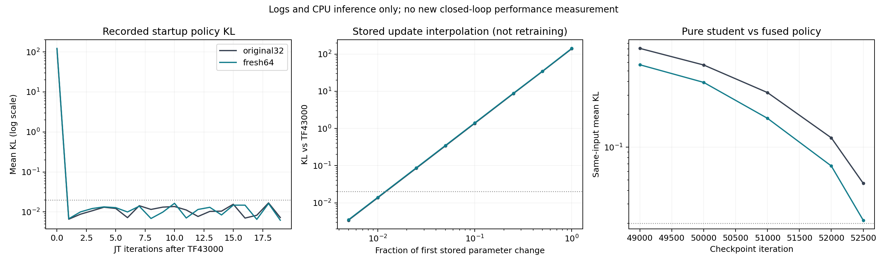

# 티처–학생 전달 성능 개선: 로그·체크포인트 기반 재검토

> 후속 실행: 사용자의 중지·재출발 요청에 따라 기존 CNN64를 정상 종료하고, 낮은 초기 LR의1-iteration 시험에서 첫 정책 급변 감소를 확인했다. TF43000부터 새 본 학습을 시작했다. 아래는 분석 당시의 계획이며 최신 실행 상태·검증 수치는 [재출발 기록](jt_initial_lr_restart_20260929.md)을 따른다.

작성: 2026-09-29. 대상: TF43000 → JT, 학생 단독 추종 성능. 현재 CNN64 학습은 유지한다.

## 결론과 적용 범위

**우선 수정할 대상은 45→8 티처 네트워크 구조가 아니라 TF→JT 진입 시의 최적화 초기화다.** 학습된 TF의 마지막 LR은 `1e-5`인데 JT는 새 optimizer와 기본 LR `1e-3`으로 시작한다. 실제 첫 iteration에서 정책 KL이 118.8/122.4로 급증했고, 같은 입력에 대한 목표 관절각도 평균 약 0.37–0.40 rad 달라졌다. 학생이 액터에 전혀 들어가지 않는 α=0에서 발생한다. 티처 인코더만 느리게 만드는 것으로 해결할 수 없는 공유 액터의 변화도 확인했다.

이 결과는 **초기 정책 급변의 존재와 수정 우선순위**를 뒷받침한다. 초기 급변을 줄이면 최종 학생 Q가 반드시 오른다는 인과효과는 아직 측정하지 않았다. 이를 확정했다고 말할 근거는 없다. 기존에 제안했던 “티처 인코더 LR×0.1부터 비교”는 아래 순서로 변경한다.

1. TF43000과 45→512→256→128→8 구조를 보존한다.
2. 진행 중인 CNN64 run의 동일 예산 결과를 확보한다.
3. 다음 새 JT는 **초기 LR만 TF의 마지막 LR로 설정**한 대조 실험을 우선한다.
4. 첫 업데이트 이후에도 정책 변화가 과도하면 전체 정책의 KL을 검사하고 되돌리는 제어를 별도 비교한다.
5. 초기 문제를 통제한 뒤에만 티처 LR 비율 1 대 0.1을 비교한다. 티처 고정·모방 손실 강화·전환 기간 연장을 한꺼번에 넣지 않는다.

## 1. 이번 분석에서 실제로 한 일

- 원본 JT 30,000 iteration 전체 로그와 진행 중인 CNN64 로그의 52,659 iteration까지 저장된 스냅샷을 집계했다.
- TF43000, 원본 JT43000–73000, CNN64 JT43000–52500의 공통 중간 체크포인트를 CPU에서 추론했다. 사용 파일과 SHA-256은 JSON에 기록했다.
- TF 및 JT71500이 방문한 저장 상태 두 자료에서 총 7,436개 입력을 선택했다. 그중 d>0, 고장 후 1초 이상 표본은 각각 1,896/1,904개다. 원본 전체 자료는 29,300개다.
- 첫 JT 저장 가중치에서 티처 인코더/액터를 각각 TF 가중치로 복원하는 반사실 입력 계산과, 저장된 가중치 변화의 선형 보간을 수행했다. **새 최적화나 보행 실험은 아니다.**
- 기존 학생 실험의 폐루프 Q·생존 결과와 비교했다. 새 GPU rollout, optimizer 생성/step, 현재 run 중단·재시작, 학습 소스 수정은 하지 않았다.

한 평가 seed의 0.5 m/s 전진, mixed terrain, 관측 노이즈·push가 꺼진 상태 자료다. 동일 입력 추론과 실제 폐루프 보행의 차이를 끝까지 구분한다.



그림의 0.02 점선은 현재 desired KL=0.01의 두 배인 비교 기준이다. 후술할 guard의 후보이며 최적 임계값이라는 뜻은 아니다.

## 2. 최종적으로 좋아져야 할 것은 무엇인가

현재 구현은 다음과 같다.

\[
z_T=f_\phi(p_t),\quad z_S=g_\psi(h_t),\quad
z_\alpha=(1-\alpha)z_T+\alpha z_S,\quad
\mu_\alpha=\pi_\theta(o_t,z_\alpha).
\]

`p_t`: 특권정보45, `h_t`: 50×48 이력, `o_t`: 현재235, `z_T,z_S`: 각각8. 학습 시 Gaussian 정책 평균이 μ이며, 배포 평가에서는 학생 latent만 입력한다.

현재 소스의 모방 손실은 제곱하지 않은 L2 norm 평균이다.

\[
L_{\rm adapt}=\mathbb E\|z_S-\operatorname{stopgrad}(z_T)\|_2,\qquad
L=L_{\rm PPO}+c_VL_V-c_HH+\beta L_{\rm adapt}.
\]

원본 스케줄은 10,000 iteration 동안 α:0→1, β:1→0이다. 학생은 모방과 PPO로 학습하고, 티처 표현과 액터도 학습 중 바뀐다. 따라서 좋은 티처는 “단독으로 잘 걷는 티처”뿐 아니라 “학생으로 바뀌어도 액터가 잘 작동하도록 전달 가능한 티처”여야 한다. 단독 티처 Q 상승만으로 학생 Q 상승이 따라오지는 않는다.

판정 순서는 **학생 단독 Q → 생존 및 속도오차 → 동일 입력 행동 차이 → latent 오차**다. latent를 단순히 축소하면 수치 오차만 작아질 수 있다. 인코더와 액터가 함께 바뀌므로 같은 latent 좌표를 유지하는 것이 최종 목적도 아니다. Saving the Limping의 공동학습도 최종 학생 입력으로 정책이 작동하도록 함께 학습하는 구조다. [논문 III-C](https://arxiv.org/html/2210.00474v3)

## 3. 새로 확인한 TF→JT 시작 문제

### 3.1 소스와 체크포인트가 일치하는 경로

1. [JointTeacherStudentRunner.load](../../legged_gym/learning/joint_teacher_student_runner.py)는 TF의 티처·액터·critic·표준편차를 복사하고 새 학생 인코더를 남긴다.
2. TF 분기에서는 optimizer를 가져오지 않는다. TF 마지막 optimizer LR `1e-5`도 전달하지 않는다.
3. [TeacherPPO](../../legged_gym/learning/teacher_ppo.py)의 초기 LR은 `1e-3`. 새 CNN64 manifest의 설정도 동일하다.
4. adaptive KL은 각 minibatch 업데이트 **전** 계산된다. 처음에는 정책이 같아 KL이 거의 0이다. 구현의 작은 수치 보정으로 양수이면 LR을 최대 `1.5e-3`까지 올리는 분기가 실행될 수 있다. 실제 첫 step의 LR은 별도 기록하지 않아 확정하지 않는다.
5. 다음 minibatch에서 큰 KL을 감지해 LR을 줄여도 이미 바뀐 가중치를 복원하지 않는다. 현재 hard KL stop은 구현되어 있지 않으며 로그의 `hard_kl_stopped`는 상수 0이다.
6. `model_43000.pt`는 TF를 복사한 직후가 아니라 **첫 JT iteration, 5 epoch×4 minibatch=20 update 후** 저장된 모델이다. 파일명만 보고 초기 동일 정책으로 취급하면 안 된다.

새 optimizer 자체가 오류라는 뜻은 아니다. 새 학생 파라미터가 있어 초기화는 합리적이다. **이미 학습된 공유 네트워크에 적용하는 첫 step의 크기를 별도로 관리하지 않는 것이 문제 후보**다. 아래 관측은 급변을 확증하지만, 저장되지 않은 첫 minibatch별 gradient까지 복원하지 못하므로 모든 원인을 LR 하나로 확정하지 않는다.

### 3.2 실제 기록

| 첫 JT iteration | 원본 CNN32 | 진행 중 CNN64 |
|---|---:|---:|
| α | 0 | 0 |
| 로그 평균 KL | 118.7664 | 122.4293 |
| 로그 최대 minibatch KL | 139.4181 | 144.2484 |
| PPO ratio clip fraction | 약 95% | 약 95% |
| 수행한 optimizer update | 20/20 | 20/20 |
| iteration 종료 시 LR | 1e-5 | 1e-5 |

종료 시 LR만 보면 문제가 안 보인다. clip fraction은 PPO 확률비의 clipping 비율이며, 관절 토크/각도 포화율이 아니다. 첫 reward가 작은 것은 episode 집계 초기화 영향도 있어 보행 붕괴의 직접 증거로 사용하지 않았다.

그 뒤 43,001–43,009 iteration의 평균 KL은 원본 0.01087, CNN64 0.01067이다. 급변은 특히 시작 시점에 두드러진다. 후속 학습이 회복할 수 있으므로 최종 성능 저하량은 이 로그로 계산할 수 없다.

### 3.3 기록된 같은 상태에서 직접 확인

아래 KL은 12개 독립 Gaussian 행동 분포에 대해 `KL(TF || JT)`를 합산한 값이다. 학습 로그와 표본 분포가 달라 로그 KL과 일치할 필요는 없다.

| d>0, 고장 후 1초 이상 입력 | 원본 CNN32 첫 JT | CNN64 첫 JT |
|---|---:|---:|
| TF 방문 상태: 목표 관절각 MAE | 0.39898 rad | 0.40144 rad |
| TF 방문 상태: 평균 KL | 139.3107 | 142.3244 |
| 학생 방문 상태: 목표 관절각 MAE | 0.37191 rad | 0.37492 rad |
| 학생 방문 상태: 평균 KL | 123.6517 | 125.9907 |

목표 관절각 차이는 `0.25 × action MAE`다. 실제 관절각 오차나 추종 오차가 아니며, 약 21–23°의 **동일 입력 정책 출력 차이**다. α=0이라 학생 latent는 이때 정책 평균에 직접 들어가지 않는다. “학생이 아직 티처를 못 따라해서 생긴 현상”만으로 설명할 수 없다.

원본 첫 JT에서 **티처 인코더만 TF로 복원**해도 평균 KL이 68.83/58.34 남는다. **액터와 행동 표준편차만 TF로 복원**하면 KL은 19.42/18.77이다. 두 모듈 모두 변했다. 비선형 결합이므로 이 수치를 더해 원인 기여율로 만들지는 않는다.

### 3.4 변화량을 줄이는 방향의 수치 검증

저장된 전체 TF 파라미터에 대해 다음을 계산했다.

\[
\vartheta(\lambda)=\vartheta_{TF}+\lambda(\vartheta_{JT,first}-\vartheta_{TF}).
\]

| 저장 변화의 비율 λ | 원본 CNN32 KL, TF 방문 상태 | CNN64 KL, TF 방문 상태 |
|---|---:|---:|
| 1 | 139.3107 | 142.3244 |
| 0.1 | 약 1.37 | 약 1.40 |
| 0.01 | 0.01358 | 0.01394 |

학생 방문 상태에서도 λ=0.01의 KL은 0.01195/0.01223이다. 즉 급변의 방향을 완전히 바꾸지 않고도 **그 변화량을 작게 제한하는 것**으로 기존 정책을 가까이 유지할 수 있다.

이는 LR을 100분의 1로 바꾼 재학습 결과가 아니다. Adam 모멘텀과 후속 gradient가 달라지므로 LR 비율과 λ를 등치하면 안 된다. 최종 Q 개선 수치도 아니다. 티처만 LR×0.1이면 충분하다는 근거로 사용할 수도 없다.

## 4. 티처 표현과 학생 용량에 대한 기존 근거

### 티처가 움직이는 것은 사실이지만 모두 해로운 것은 아니다

[직전 티처 분석](teacher_encoder_offline_20260929.md)에서 같은 입력의 티처 latent RMS는 약 3.38(TF)→4.57(49000)→9.00(51000)→21.63(53000)으로 증가했다. affine 좌표 변환으로도 차이가 완전히 없어지지 않았다. 단순 scale 변경만은 아니다.

하지만 해당 자료의 속도 정보가 latent 변화에 많이 기여했고, 티처 고정 실험은 실제 Q를 악화시켰다. 티처 표현 변화가 전부 나쁘다고 결론내릴 수 없다. 후반에는 (1−α)가 함께 줄어 raw latent RMS 증가가 액터에 그대로 전달되지도 않는다.

45D에는 현재 관측과 겹치는 선속도·각속도가 있다. 노이즈 없는 이번 저장 입력에서는 정확히 환산되지만 학습 관측은 노이즈가 있어 실험 없이 “중복이니 삭제”할 수 없다. 고장 순간에는 같은 학생 이력에 서로 다른 고장 GT가 대응할 수 있으므로 학생의 순간적인 완전 모방은 불가능한 경우가 있다. 이것은 수 초 이후의 성능 격차 전체를 설명하지는 않는다.

### 폐루프에서 이미 비교한 방법

각 행은 그 행 안의 대조군과만 비교한다. 512환경 파일럿, 한 학습 seed, 서로 다른 시작 지점이 포함되므로 행 사이 순위표가 아니다. [실험 기록](jt_student_encoder_experiments_20260928.md)

| 개입 | 대조군 Q → 개입 Q | 판단 |
|---|---:|---|
| JT49000 이후 티처 인코더 완전 고정, +500 iteration | 45.95% → 38.47% | −7.48%p. 중간 고정을 개선안으로 채택하지 않음 |
| TF부터 학생 행동 모방 보조 손실×10, +2000 | 24.17% → 16.86% | −7.31%p. 강한 모방 강제는 채택하지 않음 |
| JT53000 이후 β 하한0.01, +2000 | 43.99% → 38.55% | −5.44%p. 학생100% 이후에도 목표 latent에 묶는 방식은 채택하지 않음 |
| TF부터 CNN32→64, +2000 | 23.52% → 25.18% | +1.66%p. 고장 조건 이득, d=0은 −2.48%p여서 최종 검증 필요 |
| 원본 학생 학습 71500→73000, 독립 평가 seed116/117 | 64.68% → 67.06% | +2.38%p. 비교 기준에 73000도 포함 |

티처 고정과 β 하한의 부정 결과는 모든 고정 시점/가중치를 기각하는 증거는 아니다. 다만 현재 자료로 이를 최우선 개선안이라 할 수는 없다.

### 진행 중 CNN64의 전환 후반

52,500 iteration, α=0.95에서 같은 상태에 대해 현재 혼합 정책과 학생 단독 정책을 비교했다.

| 입력 자료 | 원본 CNN32 KL | 진행 중 CNN64 KL |
|---|---:|---:|
| TF 방문 상태 | 0.04657 | 0.02132 |
| 학생 방문 상태 | 0.04846 | 0.02138 |

혼합 latent를 학생 latent로 교체할 때의 행동 분포 변화가 두 자료에서 약 54–56% 작다. **남아 있는 티처 입력을 제거할 때 행동이 덜 달라진다는 근거**다. 두 모델은 각자 다른 액터·티처를 가졌으므로 같은 고정 티처에 대한 모방 정확도가 54–56% 향상됐다는 뜻은 아니다. 새 폐루프 Q는 아직 측정하지 않았다.

10,000 iteration 전환에서 α 한 step은 0.0001이다. 저장 가중치를 고정한 채 α만 한 step 바꾸는 영향은 위의 학생100% 강제 교체보다 훨씬 작았다. 전환이 급작스럽다는 해석만으로 기간을 늘릴 근거는 약하다. **10,000 대 20,000 전환의 통제 재학습은 아직 하지 않았으므로 장기 전환이 무효라고도 말하지 않는다.**

## 5. 다음 학습 수정 명세와 변인 통제

### 5.1 먼저 현재 실험을 완결한다

현재 CNN64는 중단하지 않는다. 기존과 같은 전역73000에서 동일 예산 평가하고, 78000은 추가5000 iteration의 별도 결과로 기록한다. 원본71500만 골라 비교하지 않고 원본73000도 포함한다. 원본 3만 신규 iteration과 CNN64 3.5만 신규 iteration을 같은 비용이라고 부르지 않는다.

### 5.2 우선 실험: TF→JT 초기 LR 인계

**고정:** TF43000, 티처45→8, 학생CNN64, reward, 환경/지형/고장 분포, α/β, PPO epochs/minibatches, seed 및 신규 iteration 수.

**변경 하나:** 새 JT optimizer와 새 학생 초기화를 유지하되, 최초 `alg.learning_rate`와 optimizer group LR을 **TF optimizer 마지막 LR=1e-5**로 함께 설정한다. 이후 기존 adaptive LR 규칙을 유지한다. TF optimizer 모멘텀까지 복사하는 변경은 섞지 않는다. 모든 그룹을 함께 설정해 학습된 액터·critic·std와 티처를 포함한다.

이는 논문이 지정한 최적값이라는 주장이 아니라, 실제 출발 checkpoint의 최적화 크기를 이어받는 **Implementation choice**다. 기존1e-3 대비1e-5 효과를 첫 업데이트부터 측정한다. 새로운 학생 학습이 느려질 수 있으므로 학생 오차와 gradient도 동시에 기록한다. 시작 LR 변경이 학생 최종 Q를 악화시키면 채택하지 않는다.

구현 위치: `joint_teacher_student_runner.py::load`의 TF 분기 또는 전용 새 실험 runner. 현재 실행 경로를 조용히 바꾸지 않고 명시적 config/manifest 필드로 구분한다.

### 5.3 KL 초과 시 되돌리는 제어는 별도 조건

현재 PPO ratio clipping은 정책 변화의 절대 상한을 보장하지 않는다. 첫 큰 update 후 **다음 update만 중단**하면 첫 급변은 남는다. 후처리 검사가 필요하다.

후보 구현은 iteration의 rollout 정책을 기준으로 고정 관측 집합에서 **업데이트 후** 평균 KL을 다시 계산하고, δ=0.02를 초과하면 해당 시도의 파라미터·Adam 상태·step counter를 되돌린 다음 LR을 낮춰 재시도한다. 유한한 재시도 한도 뒤에는 해당 업데이트를 건너뛴다. 전체 정책을 검사해야 하며 티처 인코더만 검사해서는 안 된다. 검사용 표본 평균을 제한해도 모든 상태의 KL을 제한한다는 뜻은 아니다. 전체 rollout 검사는 계산비용을 먼저 측정한다.

δ=2×desired_kl은 **Implementation choice**다. TF 시작 LR만 인계한 조건 B와, 여기에 guard를 추가한 조건 C를 따로 비교한다. 둘을 처음부터 묶고 개선 원인을 LR이라고 단정하지 않는다. 실험 A는 기존 초기화다. A/B의 첫 iteration 급변을 확인하는 짧은 시험과 최종 학생 성능 시험을 구분한다.

### 5.4 티처 LR×0.1은 그 다음

초기 문제를 통제한 B 또는 C에서 전환 후반의 표현 변화와 학생 행동 격차가 계속 크면, 티처 인코더 group만 `lr_teacher = 0.1 × lr_base`로 비교한다. 티처는 완전 고정하지 않는다. 다른 그룹은 동일하게 두고, adaptive LR 갱신에서 비율을 다시 적용해야 한다. 지금 코드는 모든 group에 같은 LR을 덮어쓰므로 group을 만드는 것만으로는 구현되지 않는다.

판정은 “latent RMS가 작아짐”이 아니라 **같은 α에서의 학생 단독 Q 상승, 최종 α=1의 Q 상승, d=0·생존 악화 여부**다. 티처 단독 Q가 유지되고 학생도 좋아져야 전달 개선 근거가 강해진다. 좋아지지 않으면 원래 비율1을 유지한다. 현재 자료로0.1이 최적이라고 말할 수 없다.

### 5.5 새 티처 사전학습은 보류

이번 문제는 TF43000의 용량 부족을 입증하지 않는다. 45D 제거, latent 차원 변경, 출력 정규화 삽입, 새 teacher reward는 한 번에 비교를 불명확하게 만든다. 우선 같은 TF에서 새 JT를 시작한다. 티처 사전학습 변경은 위 비교 후에도 분명한 성능 상한이 확인될 때 별도 연구로 취급한다.

## 6. 실행 전 검증과 성능 판정

### 구현 검증

1. TF→JT 로드 직후 α=0에서 teacher latent·action mean·std가 원본 TF와 일치할 것. 시작 LR과 모든 group LR을 첫 update 전 기록할 것.
2. group LR 비율이 adaptive KL 갱신 이후에도 유지될 것. 교사 LR만 줄이는 조건에서 다른 모듈 LR은 동일할 것.
3. guard를 도입하면 거절 전후 모델 및 optimizer state가 완전히 복원되는지 검증할 것. pre-step 검사만으로 통과했다고 하지 않을 것.
4. 각 minibatch의 pre/post KL, 적용 LR, actor/teacher/student/critic gradient norm, clip 계수, 실제 update norm, 거절 횟수를 기록할 것. 현재 로그에는 손실별 gradient 방향이 없으므로 PPO·value·모방 간 충돌을 확인했다고 주장하지 않는다.
5. 훈련 seed와 별개로 eval seed, 지형, 초기 물성/상태, joint·d·onset의 hash를 기록할 것. seed 숫자가 같다는 것만으로 paired라고 부르지 않을 것.

### 단계와 예산

- 1차: 실제 4096환경 조건의 최초1/20 iteration으로 초기 정책 보존을 검사한다. 기존512환경 파일럿과 직접 동등 비교하지 않는다.
- 2차: 동일 seed의 새 JT 각2000 iteration에서 초기 학생 학습, d=0 보행, Q를 진단한다. α=0.2 결과가 좋다고 최종 채택하지 않으며, 초반 이득이 작다는 이유만으로 최종 가능성을 기각하지 않는다.
- 3차: 원본과 같은 신규30,000 iteration, 전역73000에서 학생 단독을 비교한다. 모델 선택용 seed와 최종 시험용 seed를 분리한다.
- 최종 향상 주장에는 독립 학습 seed 최소3개를 사용한다. 같은 학습 모델의 평가 seed3개는 학습 재현성3회가 아니다. 제한된 파일럿만 가능하면 그 수준으로 명시한다.

### 지표

기존 onset-v2의 0.5m/s 전진, `onset ~ U(2,10)s`, 고장 후20초, 12관절×d∈{0,.2,.4,.6,.8,1}, seed별48반복을 일차 비교로 고정한다. d=0 정상 조건과 d>0 고장 평균, d=1을 각각 보고한다.

\[
Q=\frac{1}{N}\sum_{t=1}^{N}
\mathbf1[\mathrm{alive}_t]
\mathbf1[|v_x-0.5|\le0.1]
\mathbf1[|v_y|\le0.1]
\mathbf1[|\omega_z|\le0.2].
\]

단위는 m/s, m/s, rad/s이며 분모는 넘어지고 난 뒤를 포함한 고정20초다. 넘어지기 전만 잘 걸었다고 Q가 부풀지 않는다. 생존율과 세 축 RMSE를 같이 보고한다. 현재 evaluator의 RMSE는 살아 있는 고장 후 시간 기준이므로 Q·생존율 없이 단독 비교하지 않는다. 회복률은 주 지표에서 제외한다.

기본 threshold 외 기존 strict/loose threshold에서도 순위가 유지되는지 함께 확인한다. 정상 성능이나 생존율을 희생해 평균 Q만 오른 결과는 무조건 채택하지 않는다. 실용적인 최소 개선 폭은 예를 들어 Q +3%p, d=0 Q 및 생존율 하락 각각1%p 이내를 사전 기준으로 정할 수 있으나, 이는 **새 Implementation choice**이며 관측된 성능이 아니다. 신뢰구간은 학습 seed 간 변동과 episode 평가 오차를 분리한다.

## 7. 근거의 강도와 미해결 항목

| 주장 | 분류 | 현재 확인 범위 |
|---|---|---|
| 티처 MLP hidden512/256/128, 출력8의 선행 사용 | Paper Explicit | Saving the Limping IV-A. 정확한 현행45D 구성의 최적성 증명은 아님 |
| 초기 LR 인계 누락 및 첫 정책 급변 | Derived | 현재 코드 경로, 두 실제 run 로그, 두 상태 자료 추론이 일치 |
| 기존 고정·강한 모방 조건의 Q 하락 | Derived | 해당 단일 학습 seed/파일럿 조건에 한정 |
| CNN64의 작은 초기 Q 이득 및 후반 행동 전달 격차 감소 | Derived | 최종 전체 학습 Q 향상은 미측정 |
| LR 인계/guard가 최종 Q를 올리는 정도 | Unspecified | 새 통제 학습 필요 |
| 티처 LR0.1 최적성, 긴 전환의 유효성 | Unspecified | 직접 통제 실험 없음 |
| 학생의 최종 성능이 TF와 같아질 수 있는가 | Unspecified | 관측 차이와 실제 학습 한계를 분리해야 함 |

## 산출물과 재현

- 새 집계: `logs/evaluations/jt_learning_mechanism_20260929/results.json`
- 검증: 같은 폴더 `verification.json`
- 재현 스크립트: [analyze_jt_learning_mechanism.py](../../legged_gym/scripts/analyze_jt_learning_mechanism.py)
- 독립 KL 계산·수치 검증·그림: [verify_jt_learning_mechanism.py](../../legged_gym/scripts/verify_jt_learning_mechanism.py)
- Gaussian KL을 PyTorch distributions와 독립 대조한 최대 차이: `5.68e-14`. λ=0/1의 기준 모델 일치, action→rad 환산, α=0도 검사했다.
- 입력 checkpoint hash를 종료 시 재검사했다. CUDA 초기화는 false. 기존 인코더 재구성의 실제 클래스 대비 출력 검증은 [이전 검증 기록](teacher_encoder_offline_20260929.md)에 있다.

```bash
cd /home/jihun/legged_gym
CUDA_VISIBLE_DEVICES='' PYTHONNOUSERSITE=1 OMP_NUM_THREADS=1 MKL_NUM_THREADS=1 OPENBLAS_NUM_THREADS=1 \
nice -n 19 /home/jihun/Capstone2/miniconda3/envs/WIM/bin/python \
legged_gym/scripts/analyze_jt_learning_mechanism.py \
--output logs/evaluations/jt_learning_mechanism_recheck
```

출력 폴더는 새 이름이어야 한다. 활성 run의 로그/새 checkpoint가 늘어나므로 재실행 스냅샷은 달라질 수 있다. 동일 분석 재현은 JSON에 기록한 파일·hash·iteration 범위를 따른다.
