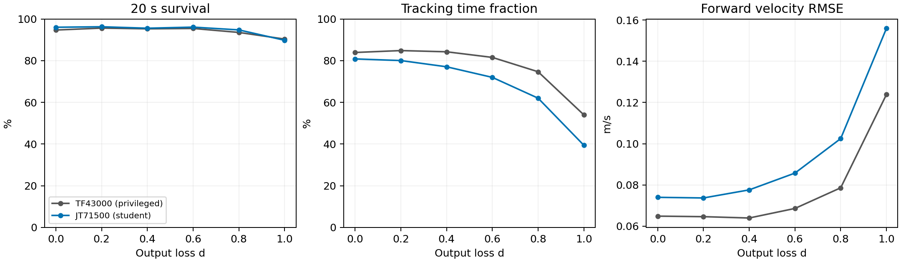

# 무작위 onset 진단 재평가 v2 — 2026-09-28

이 결과는 기존 TF43000/JT71500의 구현·성능 진단이다. 최종 독립 시험이나 여러 학습 seed의 재현성 실험은 아니다. 신규 학습은 실행하지 않았다.

## 조건과 검증

- A1 / Isaac Gym GPU PhysX, 공통 JT 환경에서 같은 초기 상태로 두 정책 평가.
- 목표 몸체 속도 `(vx, vy, yaw rate)=(0.5 m/s, 0, 0)`; 내부 명령 재샘플링도 고정.
- onset 2–10초 범위의 0.02초 격자 균등 무작위. 고장 이후 공통 20초.
- 12관절 × 6강도(d=0,.2,.4,.6,.8,1) × 48반복 × 평가 seed 3개(101,102,103). 정책당 10,368 에피소드; 고장 조건 8,640, 무고장 조건 1,728.
- 기존 혼합 거친 지형, 물리 DR 유지, 관측 noise/외부 push off. 현재 학습 환경의 모든 교란을 포함한 평가는 아니다.
- 초기 root/관절 상태, 마찰·추가질량·모터/Kp/Kd 계수, 초기 관측, 전체 지형, 고장 배정 hash: 세 seed 모두 정책 간 일치.
- 매 step 명령/관측/history 일치 및 action/속도 유한성 검사 통과.
- 분모/조기 종료/무작위 배정 unit test 3개와 TF/JT GPU smoke 통과.
- 기반 Git HEAD: `b7fd12a04230109937b3ddf35c30f4eb21af0279`. 새 evaluator와 protocol의 SHA-256은 각 JSONL metadata에 기록.

## 핵심 결과

고장 강도 .2–1.0을 같은 수로 포함한 전체 평균. RMSE는 에피소드별 RMSE의 평균이며 최초 종료 이전 유효 샘플에서 계산한다. Q는 전체 20초를 분모로 사용한다.

| 지표 | TF43000 특권정보 티처 | JT71500 학생 |
|---|---:|---:|
| 20초 생존율 | 94.03% | 94.47% |
| 추종 충족 시간 비율 Q | 75.86% | 66.10% |
| 종료 직전 5초 추종 시간 비율 | 74.00% | 63.93% |
| 전진속도 RMSE (m/s) | 0.0799 | 0.0991 |
| 횡속도 RMSE (m/s) | 0.0689 | 0.0807 |
| Yaw rate RMSE (rad/s) | 0.1083 | 0.1348 |
| 평균 실제 전진속도 (m/s) | 0.4788 | 0.4672 |
| 기존 1초 안정 구간 획득률 | 88.90% | 79.77% |
| 생존했지만 기존 안정 구간 미획득 | 8.19% | 17.40% |

## 학생의 고장 강도별 결과

| 출력 상실 d | 생존율 | 추종 시간 Q | vx RMSE (m/s) | 평균 vx (m/s) |
|---|---:|---:|---:|---:|
| 0.0 | 96.01% | 80.82% | 0.0740 | 0.4806 |
| 0.2 | 96.24% | 80.04% | 0.0737 | 0.4821 |
| 0.4 | 95.54% | 77.05% | 0.0776 | 0.4799 |
| 0.6 | 96.06% | 71.97% | 0.0857 | 0.4732 |
| 0.8 | 94.73% | 62.00% | 0.1025 | 0.4640 |
| 1.0 | 89.76% | 39.44% | 0.1559 | 0.4370 |

직관적으로 학생은 고장 조건 전체에서 고장 후 20초 중 평균 **13.22초**, d=1에서는 **7.89초** 동안 세 추종 기준을 동시에 만족했다.
무고장 d=0은 현재 fault-trained 정책에 고장을 주지 않은 대조 조건이다. 고장 미학습 정상 정책 baseline을 대신하지 않는다.



## 지표 해석

- 생존: 최초 실패 종료 없이 고장 후 20초까지 유지. base 접촉력 norm >1 N이 종료 조건이며 final transition 종료도 실패로 계산.
- Q: 살아 있으면서 `|vx-.5|≤.1 m/s`, `|vy|≤.1 m/s`, `|yaw rate|≤.2 rad/s`를 동시에 만족한 시간 / 20초. 조기 종료 이후는 충족 시간 0.
- 기본 threshold는 프로젝트 설계다. 선행연구에서 그대로 가져온 보편적인 표준이라고 주장하지 않는다.
- 기존 회복률은 연속 1초 vx/yaw 기준을 한 번 충족한 사건으로, 이후의 추종 지속이나 고장으로 실제 성능이 하락했는지를 보장하지 않는다.
- 평균 전진속도만 목표에 가깝더라도 횡속도·회전·진동·종료 문제가 있을 수 있다. Q와 각 RMSE를 함께 제시한다.

### 임계값 민감도

| 정책 | 엄격 (.05,.05,.1) | 기본 (.1,.1,.2) | 완화 (.2,.2,.4) |
|---|---:|---:|---:|
| teacher | 34.66% | 75.86% | 91.96% |
| student | 26.35% | 66.10% | 88.32% |

각 tuple은 vx/횡속도 오차(m/s), yaw rate 오차(rad/s)의 허용값이다. 세 기준은 실행 전 코드에 고정했고 결과를 본 뒤 선택하지 않았다.

### 평가 seed별 학생 결과

| 평가 seed | 생존율 | Q | vx RMSE |
|---|---:|---:|---:|
| 101 | 94.97% | 66.50% | 0.0995 |
| 102 | 93.26% | 65.18% | 0.1018 |
| 103 | 95.17% | 66.62% | 0.0958 |

## 판단과 다음 작업

1. 학생은 고장 시에도 보행을 대체로 유지하지만, 생존을 정확한 지속 추종으로 등치하면 안 된다. 특히 완전 출력 상실은 주요 한계다.
2. 티처와 학생의 생존/추종 격차는 다른 정보 조건의 정책 간 진단이며, 공동학습이 분리학습보다 우수하거나 열등하다는 실험이 아니다.
3. 현재 결과만으로 프로젝트를 폐기할 이유는 없다. 반대로 모든 단일 관절 고장에서 목표 추종을 유지한다고 주장할 근거도 없다.
4. 새 학습 이전에 고장 미학습 정상 정책 baseline을 확보하고 동일 평가에 넣는다. d=.2–.8와 d=1을 구분하여 개선 대상·주장 범위를 정한다.
5. 재학습은 관측/명령 버그를 수정하는 작업과 분리한다. 이번 버그는 평가 경로에서 확인됐으며 학습 경로가 같은 버그를 가진다고 단정하지 않는다.
6. v1 대비 수치 변화에는 onset 분포·초기화·종료 처리 차이도 포함된다. 명령 불일치 수정의 단독 인과효과는 이 평가로 분리하지 않았다.
7. 논문 최종 표는 설정 동결 후 별도 seed/지형으로 생성한다. 현재 진단을 그대로 최종 독립 시험이라고 부르지 않는다.

## 재현과 산출물

- [구체적인 학부 논문 계획](../plan/undergraduate_paper_revision_v2.md)
- 원시 JSONL/metadata/trace/log: `logs/evaluations/onset-v2-diagnostic-20260928/`
- 집계: `summary.json`; 실행 명령: `manifest.json` (같은 폴더).
- 기존 결과 및 체크포인트는 덮어쓰지 않았다. 아래 명령의 출력 폴더는 신규 경로를 사용해야 한다.

```bash
env PATH=/home/jihun/Capstone2/miniconda3/envs/WIM/bin:$PATH \
  PYTHONPATH=/home/jihun/legged_gym:/home/jihun/Capstone2/isaacgym/python \
  PYTHONNOUSERSITE=1 \
  python -m legged_gym.scripts.run_onset_v2_diagnostic \
  --output-dir logs/evaluations/onset-v2-diagnostic-new-run
```
