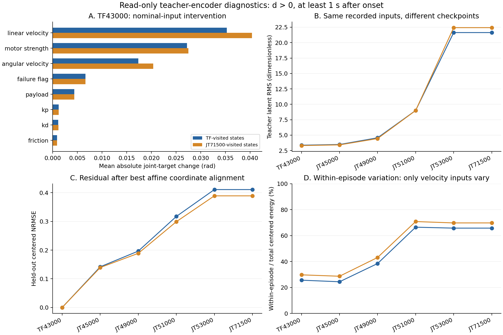
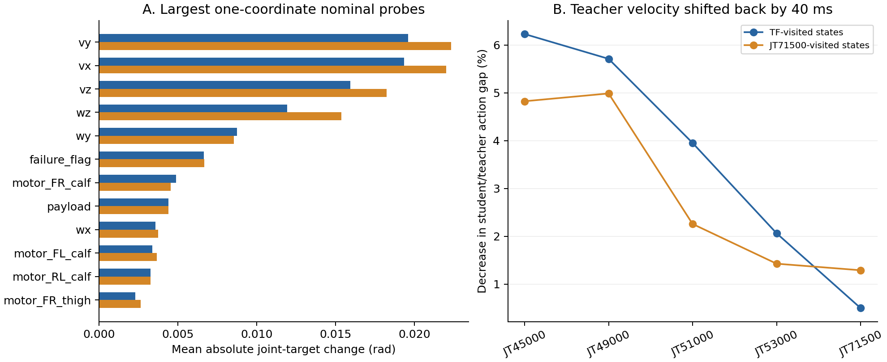

# TF43000 특권정보 및 JT 티처 표현 진단

> **후속 분석에 따른 우선순위 변경:** [JT 시작 및 전달 성능 재검토](jt_teacher_student_improvement_review_20260929.md)에서 TF→JT 초기 LR 인계 누락과 첫 정책 급변을 확인했다. 아래의 티처 인코더 LR×0.1 제안보다 **공유 네트워크 전체의 시작 업데이트 통제**를 먼저 비교한다. 사용자의 구조 보존 방침에 따라 45→8은 유지하고 context 분리안은 보류한다. 이 문서의 측정값은 유지하되, 다음 실험 순서는 후속 문서를 따른다.

2026-09-29. **재학습 없이 저장된 입력과 체크포인트만 CPU로 계산한 결과**다. 현재 실행 중인 64채널 JT 학습(PID 602002)은 유지했다. 진단은 CUDA를 초기화하지 않았고, CPU 1스레드·nice 19로 실행했다. 학습 구현·설정·체크포인트를 변경하지 않았다.

## 판단

1. **TF43000에서 고장 정보를 지우거나 티처 MLP를 더 크게 만들 근거는 이번 검사에서 나오지 않았다.** 모터 출력 계수는 실제 관절 명령에 영향을 준다. 마찰·PD 계수 영향은 이 평가 분포에서 상대적으로 작다.
2. **더 구체적인 수정 대상은 JT 전환 후반에 크게 변하는 티처 표현이다.** 고정 입력에서도 latent가 커지고, TF43000 latent와의 단순 선형 좌표변환으로 설명되지 않는 차이가 증가했다. 그 변화에는 순간 속도 정보에 대한 반응 증가가 포함된다. 변화가 학생 성능 저하의 원인이라는 인과 결론이나, 불필요한 변화라는 결론은 아직 아니다.
3. **첫 재학습 후보는 티처 인코더의 학습률만 낮추는 JT 대조 실험**이다. TF43000을 그대로 시작점으로 사용한다. 두 번째 구조 후보는 현재 관측에도 있는 속도 6D와 물성·고장 context를 분리하는 것이다. 후자는 새 티처 학습과 학생 평가까지 필요하다.
4. 단순히 latent 숫자를 작게 만들거나 모방 오차를 낮추는 것을 성공으로 판정하지 않는다. 최종 기준은 학생 단독 추종 시간 비율 Q, 생존율, 속도 RMSE다.



## 데이터와 범위

- 원본 체크포인트: TF43000, 기존 JT43000/43500/45000/49000/51000/53000/71500. 현재 실행 중인 새 64채널 run의 체크포인트는 사용하지 않았다.
- TF43000이 방문한 상태 14,589개와 JT71500이 방문한 상태 14,711개: 총 29,300개. 두 자료는 각각 288개 기록 에피소드를 포함한다. 서로 다른 정책의 방문 분포지만 독립 학습 seed 반복은 아니다.
- 기록 조건: 0.5 m/s 전진, mixed terrain, 무작위 onset 2–10초, 고장 후 최대 20초. 센서 노이즈·push는 꺼져 있다. 실제 학습에서는 센서 노이즈가 켜져 있으므로 이 차이를 명시한다.
- 특권정보 개입은 에피소드마다 onset 이전·직후·후기 상태를 골라 각각 3,712/3,724개 입력에 수행했다. 아래 주요 표는 `d>0`, 고장 1초 이후 1,896/1,904개 입력을 사용한다. 살아 있을 때 기록된 상태에 대한 평균이며 에피소드 성능 또는 Q가 아니다.
- latent 변화·속도 시점 검사는 전체 기록 입력을 사용했다. 좌표정렬은 에피소드 단위 3/4 자료에서 계산하고 나머지 1/4에서 평가했다. 분할은 `(env_id // 72 // 12) % 4 == 3`이며 양쪽에 12관절 모두 포함된다. 아래 정렬 검증의 고장 후 표본은 2,235/2,175개다.
- 출력층은 8D, Teacher MLP는 `45 → 512 → 256 → 128 → 8`이다. 출력 크기에 제한이나 별도 정규화가 없는 현재 구조를 그대로 읽었다.

## 45D 입력을 바꿨을 때의 영향

45D의 구성은 마찰 1, 추가 질량 1, 유효 모터 출력 계수 12, Kp 계수 12, Kd 계수 12, 선속도 3, 각속도 3, 고장 flag 1이다. flag는 관절 번호가 아니라 고장 유무의 이진값이다. 고장 관절·강도의 정보는 모터 출력 계수에도 들어 있다.

한 그룹씩 바꾸되 actor의 current235와 나머지 특권정보는 고정했다. 기본 대체값은 마찰 0.875, 추가 질량 1 kg, Kp/Kd 배율 1, 속도는 자료의 각 성분 중앙값이다. 모터 계수는 **동일 에피소드의 실제 고장 전 계수**로 복원했다. flag 단독 변경은 모터 계수와 모순될 수 있어, 모터+flag 동시 정상 복원도 검사했다.

또한 강도와 대략적인 onset 경과 구간을 맞춘 표본 사이에서 그룹 값을 교환해 결론의 방향을 확인했다. 두 방법 모두 기록된 운동 상태와 바뀐 입력이 물리적으로 일관된다는 보장은 없다. **네트워크 입력 의존성 검사이며, 물리 파라미터를 변경한 시뮬레이션 실험이 아니다.**

목표 관절각의 평균 절대 변화는 다음과 같다.

\[
\Delta q_{\mathrm{MAE}}=
\frac{0.25}{12N}\sum_{t=1}^{N}\sum_{j=1}^{12}
\left|\pi_j(o_t,\mu(p'_t))-\pi_j(o_t,\mu(p_t))\right|.
\]

단위는 rad이다. 동일 current observation에서 나온 목표 관절각 명령의 차이지, 실제 관절 오차나 추종 RMSE가 아니다.

| TF43000 입력 개입 | TF 방문 상태: 명령 변화(rad) | JT71500 방문 상태: 명령 변화(rad) |
|---|---:|---:|
| 선속도 3D → 중앙값 | 0.03531 | 0.04040 |
| 모터 출력 계수 12D → 해당 에피소드 고장 전 값 | 0.02722 | 0.02751 |
| 각속도 3D → 중앙값 | 0.01735 | 0.02037 |
| 고장 flag → 0 | 0.00663 | 0.00666 |
| 추가 질량 → 1 kg | 0.00440 | 0.00439 |
| Kp 배율 12D → 1 | 0.00123 | 0.00124 |
| Kd 배율 12D → 1 | 0.00114 | 0.00115 |
| 마찰 → 0.875 | 0.00089 | 0.00090 |
| 모터 출력 계수+flag 동시 정상 복원 | 0.02803 | 0.02829 |

- `d=1`에서 모터+flag 정상 복원의 명령 변화는 **0.07084/0.07220 rad**로 더 크다. 고장 정보는 제어에 영향을 주고 있다. 이것만으로 고장 처리의 최적성은 알 수 없다.
- 그룹을 교환한 검사에서도 속도와 모터 계수의 영향이 상대적으로 컸다. 예를 들어 선속도 교환은 0.05349/0.06008 rad, 모터 계수 교환은 0.03734/0.03692 rad였다.
- 45개 성분의 개별 검사도 수행했다. 선속도 성분과 yaw rate의 영향이 큰 편이었다. 개별 모터 계수 영향은 그 관절이 실제 고장인 표본 비중에도 좌우되므로, 이 순위를 관절 취약성 순위로 해석하지 않는다.
- matched permutation에서 고장 flag 변화가 0인 것은 같은 강도·onset 구간끼리 교환해 flag가 같기 때문이다. flag가 중요하지 않다는 증거가 아니다.
- 그룹마다 대체값과 교란 크기가 다르다. 이 표는 해당 개입·데이터 분포에 대한 민감도이며 보편적인 인과 중요도 순위가 아니다. 마찰·PD 계수를 실제 모델에서 삭제해도 된다는 결론도 아니다.

### 속도 정보의 중복

이 기록 자료에서는 `current[:3]/2`와 privileged 선속도가 정확히 같고, `current[3:6]/0.25`와 privileged 각속도도 정확히 같다. 따라서 clean velocity를 current observation의 속도로 치환했을 때 latent·행동 차이는 **0**이었다. 학생 history의 마지막 프레임도 current의 앞 48개 값과 일치했다.

이는 현재 평가 입력에서 속도가 특권정보에만 존재하지 않는다는 뜻이다. **학습에서는 센서 노이즈가 있으므로, 티처의 clean velocity 경로가 항상 완전히 불필요하다는 뜻은 아니다.** 다만 8D가 숨은 물성뿐 아니라 이미 별도 경로로 액터에 들어가는 순간 속도까지 다시 표현하고 있다는 구조적 특징은 확인했다.

## JT에서 latent가 커지는 현상의 분해

동일 입력에 각 checkpoint의 티처 인코더를 적용했다. TF43000 표현에 대해 다음 두 좌표정렬을 계산했다.

\[
\hat z_k^{\mathrm{scalar}}=s_k(z_{TF}-\bar z_{TF})+\bar z_k,
\qquad
\hat z_k^{\mathrm{affine}}=A_k z_{TF}+b_k.
\]

\(s_k,A_k,b_k\)는 기록 자료 일부의 최소제곱 해다. 모델 학습이나 가중치 갱신이 아니라 표현을 비교하기 위한 사후 통계 계산이다. 오차는 별도 에피소드에서 계산한다.

\[
E_{\mathrm{align}}=
\frac{\operatorname{RMS}(z_k-\hat z_k^{\mathrm{affine}})}
{\operatorname{RMS}(z_k-\overline{z_k})}.
\]

아래 두 숫자는 각각 TF 방문 상태 / JT71500 방문 상태의 결과다.

| checkpoint | 티처 latent RMS | 선형 좌표정렬 후 centered NRMSE | 정렬된 TF 표현과 실제 해당 티처 표현의 관절 명령 차이(rad) |
|---|---:|---:|---:|
| TF43000 | 3.375 / 3.314 | 0 / 0 | 약 0 / 약 0 |
| JT45000 | 3.485 / 3.423 | 0.142 / 0.139 | 0.00808 / 0.00777 |
| JT49000 | 4.573 / 4.448 | 0.197 / 0.189 | 0.01718 / 0.01777 |
| JT51000 | 9.004 / 8.990 | 0.317 / 0.299 | 0.03429 / 0.03513 |
| JT53000 | 21.632 / 22.430 | 0.411 / 0.389 | 0.10659 / 0.11340 |

관절 명령 차이는 각 행의 **동일한 해당 checkpoint 액터**에 실제 \(z_k\)와 정렬된 TF 표현을 각각 넣어 비교했다. 체크포인트 간 액터가 다르기 때문에 열 전체를 티처 제어 성능의 순위로 읽으면 안 된다.

JT53000에서는 평균 이동과 공통 배율만 보정한 잔차가 0.779/0.773이고, 모든 8×8 선형변환을 허용해도 0.411/0.389가 남았다. **단순한 숫자 확대나 선형 좌표변환만으로 설명되지 않는 표현 변화**가 있다. 0.411은 정확도나 정보 손실 41.1%가 아니라 위 정의의 RMS 비율이다. 이 결과만으로 새로운 유용한 정보가 늘었다거나 표현이 나빠졌다고 단정할 수 없다.

JT53000 이후에는 티처 인코더가 거의 같지만 학생과 shared actor는 계속 달라진다. 학생 비중이 1이 된 뒤의 티처 경로는 원래 TF43000 기준 정책과 다르며 보행 성능 기준으로 사용할 수 없다. 원래 기록 분석에서도 이 시기의 학생 단독 Q는 장기적으로 올라갔다.

### 순간 속도에 의한 변동

고장 후 1초가 지난 동일 에피소드 안에서는 모터 계수·마찰·추가 질량·PD 계수·flag가 고정되어 있는 것을 확인했다. 달라지는 privileged 입력은 속도 6D뿐이다. 따라서 에피소드 내부 latent 변동은 이 속도 입력 변화에 의해 생긴다.

\[
F_{\mathrm{within}}=
\frac{\sum_i\|z_i-\bar z_{\mathrm{episode}(i)}\|^2}
{\sum_i\|z_i-\bar z\|^2}.
\]

| checkpoint | 에피소드 내부 변동 / 전체 centered 변동 |
|---|---:|
| TF43000 | 25.6% / 29.7% |
| JT45000 | 24.4% / 28.6% |
| JT49000 | 38.4% / 43.1% |
| JT51000 | 66.4% / 70.8% |
| JT53000 | 65.7% / 69.7% |

**JT 후반 티처 latent는 같은 에피소드의 순간 운동 변화에 더 강하게 반응한다.** 이 비율은 고장 정보 인식률도, 물성 정보와 속도 정보의 완전한 독립 분해도 아니다. 에피소드 간 평균 차이에도 속도의 영향이 포함될 수 있다. 또 운동 정보는 제어에 필요하므로 비율 증가 자체가 결함은 아니다.

### 최신 40 ms 차이만으로 설명되는지

현재 CNN은 history 50프레임 중 frame0..47에 반응하고 최신 frame48/49를 사용하지 않는다. 티처의 속도 6D만 frame47, 즉 40 ms 전 값으로 바꾸고 다른 정보는 그대로 두었다.

그 시점의 학생 출력과 티처 경로 행동의 차이가 줄어든 비율:

| checkpoint | 행동 차이 감소율 |
|---|---:|
| JT45000 | 6.23% / 4.82% |
| JT49000 | 5.71% / 4.99% |
| JT51000 | 3.95% / 2.26% |
| JT53000 | 2.06% / 1.43% |
| JT71500 | 0.50% / 1.29% |

시점 차이는 일부 영향을 주지만 **전체 모방 격차를 설명하지 않는다.** 이것은 티처 입력을 지연한 기록 상태 검사이며 CNN을 수정한 새 정책의 성능 개선율이 아니다. 과거 최신48프레임 사용 실험의 오프라인 개선도 작았다는 결과와 함께 해석한다.



### 정규화만으로는 성능이 좋아졌다고 볼 수 없다

\[
\tilde z=D^{-1}(z-m),\quad
\tilde W_z=W_zD,\quad
\tilde b=b+W_zm.
\]

이렇게 latent 평균·표준편차를 바꾸면서 액터 첫 층을 보상하면 출력 행동은 수학적으로 같다. CPU 임시 모델에서 실제 검증한 최대 행동 차이는 부동소수점 오차 수준인 **1.91×10⁻⁵ 이하**였다. 저장된 가중치는 바꾸지 않았다. 따라서 latent 값이나 raw L2를 작게 만든 것만으로 개선을 주장해서는 안 된다. 정규화가 이후 학습을 안정화할 가능성은 별도의 학습 실험 질문이다.

## 결과에 따른 수정 우선순위

### 1순위: JT 티처 인코더의 변화 속도 완화

현재 TF43000과 네트워크를 그대로 쓰고, **티처 인코더 optimizer 학습률 배율만 1.0 대 0.1**로 비교하는 것이 가장 작은 통제 변경이다. 0.1은 검증된 최적값이 아니라 후보값이다. Student encoder, actor, critic, alpha/beta schedule, 환경, 보상, 표본 수는 맞춘다.

현재 학습 중인 width64 조건과 비교하려면 양쪽 모두 width64, TF43000 시작, 4,096환경, 같은 seed, 신규 35,000 iteration, 10,000-iteration 전환으로 맞춘다. 중단 checkpoint를 이어 붙이지 않는다. 이 보고서에서는 실행하지 않았다.

**구현 시 주의:** `teacher_ppo.py`의 adaptive-KL 조절이 모든 optimizer group의 LR을 같은 `self.learning_rate`로 덮어쓴다. teacher group을 분리하는 것만으로는 충분하지 않고, adaptive 변경에도 group별 배율이 유지되도록 해야 한다. optimizer state 로드와 teacher/actor 초기 tensor 일치도 함께 확인해야 한다.

이 후보는 티처를 완전히 고정하는 방식과 다르다. 이전 JT49000→49500 개입에서는 완전 고정이 학생 Q를 45.95%→38.47%로 낮췄으므로, 현재 증거로 완전 고정을 우선 채택하지 않는다. 학습률을 낮추는 효과는 아직 검증되지 않았다.

**가설의 판정:** 같은 기록 입력에서 표현 변화가 줄고, 동등한 budget의 학생 단독 Q가 향상되는지 확인한다. 표현 변화만 줄고 Q가 떨어지면 이 수정은 채택하지 않는다. 45k/49k/51k/53k/후기 체크포인트를 비교하고, 최종 정책은 별도의 평가 seed로 확인한다. 학습 seed 반복 없이 일반적인 개선이라고 주장하지 않는다.

### 2순위: 현재 속도와 숨은 물성 context를 분리

보다 구조적인 후보는 티처 encoder 입력에서 속도 6D를 분리해 **39D context → latent8**로 만드는 것이다. 현재 속도는 기존 current235 경로로 액터에 계속 제공한다. 학생은 history에서 숨은 context의 표현을 추정하도록 한다.

이는 모터 출력 계수·PD·마찰 등 환경 정보를 버리는 안이 아니다. 이미 current 경로에 있는 순간 속도를 latent가 다시 강하게 표현하는 부담을 줄일 수 있는지 묻는 실험이다. **새 티처와 그 티처를 사용하는 학생을 함께 평가해야 한다.** 노이즈가 있는 학습에서 clean velocity를 잃어 티처 성능이 떨어질 수 있어 개선이 보장되지 않는다. 기존 TF43000 체크포인트에 입력만 잘라 넣어 새 모델이라고 부르면 안 된다.

한 번에 LR 변경, 39D 구조 변경, critic 분리, latent 정규화를 모두 적용하지 않는다. 특히 현재 teacher encoder는 actor와 critic 경로를 공유하지만, 이번 데이터에는 PPO advantage/return이 없어 critic gradient가 표현 변화의 주원인인지는 검증하지 못했다. critic 분리는 추가 원인 검사 이후 후보로 남긴다.

### 현재 근거가 부족한 선택

- 티처 MLP 또는 latent 차원 확대: 이번 결과는 용량 부족을 입증하지 않는다.
- 마찰·PD·고장 flag의 즉시 삭제: 한정된 명령·지형 분포에서의 입력 민감도만으로 삭제 효과를 알 수 없다.
- 티처 출력에 `tanh`/LayerNorm만 끼워 넣기: 기존 액터와의 연결을 바꾸며 raw latent 오차 축소와 보행 개선은 다르다.
- 학생과 맞추기 위해 티처에도 모방 손실을 역전파: 표현이 함께 무의미해지는 가능성을 배제해야 하며, 현재 검증된 개선안이 아니다.

## 검증·산출물

- GPU context 생성 없음(`cuda_initialized=false`), optimizer 생성·step 없음, Isaac Gym import·simulation 없음.
- 독립 실행용 MLP/CNN 계산을 실제 소스의 클래스 정의와 비교: 두 자료 × TF43000/JT45000/JT53000에서 teacher latent, actor action, student latent의 최대 차이 **0**.
- 입력 체크포인트 SHA-256을 종료 후 다시 확인해 모두 일치. 현재 학습 PID와 실행 명령도 동일함을 확인.
- 집계: `logs/evaluations/teacher_encoder_offline_20260929/results.json`
- 속도 분해·지연: 같은 폴더 `followup.json`
- 검증 기록: 같은 폴더 `conformance.json`
- 45개 성분 전체 결과: 같은 폴더 `dimension_interventions.csv`
- 그룹별 결과: 같은 폴더 `group_interventions.csv`
- 그림: [PNG](teacher_encoder_offline_20260929/teacher_encoder_diagnostics.png), [PDF](teacher_encoder_offline_20260929/teacher_encoder_diagnostics.pdf)

재현은 저장 파일 덮어쓰기를 막기 위해 새로운 output 폴더를 지정한다. 아래 예시가 이미 존재한다면 새 이름을 사용한다.

```bash
cd /home/jihun/legged_gym
CUDA_VISIBLE_DEVICES='' PYTHONNOUSERSITE=1 OMP_NUM_THREADS=1 MKL_NUM_THREADS=1 OPENBLAS_NUM_THREADS=1 \
nice -n 19 /home/jihun/Capstone2/miniconda3/envs/WIM/bin/python \
legged_gym/scripts/diagnose_teacher_encoder_offline.py \
--output logs/evaluations/teacher_encoder_offline_recheck

CUDA_VISIBLE_DEVICES='' PYTHONNOUSERSITE=1 OMP_NUM_THREADS=1 MKL_NUM_THREADS=1 OPENBLAS_NUM_THREADS=1 \
nice -n 19 /home/jihun/Capstone2/miniconda3/envs/WIM/bin/python \
legged_gym/scripts/diagnose_teacher_encoder_followup.py \
--output logs/evaluations/teacher_encoder_offline_recheck/followup.json
```

## 해석의 한계

이번 결과로 **티처 표현을 어떻게 바꿔볼지에 대한 우선순위는 구체화됐지만, 개선 폭은 측정하지 않았다.** 재학습·새 보행 rollout이 없어 새 모델의 Q나 생존율을 제시할 수 없다. 학생 정보의 식별 가능성, 향상 가능한 최종 성능, 표현 변화의 인과효과도 아직 미확정이다. 기록된 한 학습 계보와 한 평가 seed의 0.5 m/s 조건을 넘어 일반화하지 않는다.
